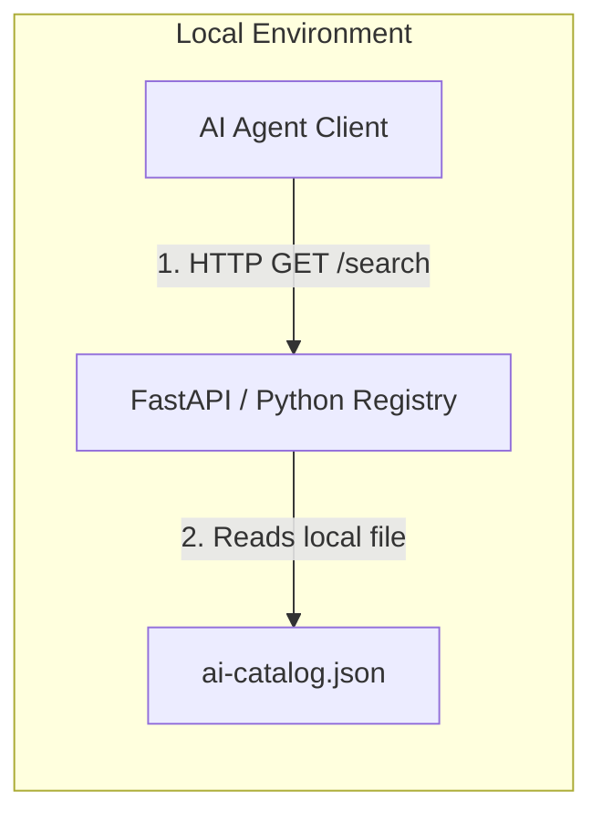
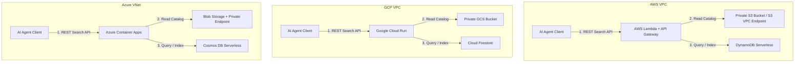

# ADR-0001: Private Hosting Architecture for Agentic Resource Discovery (ARD)

- **Status:** Proposed
- **Date:** 2026-06-21
- **Deciders:** Developer, Product Architect
- **Consulted / Informed:** AI Engineering Team, Platform Team, Security Working Group
- **Tags:** platform, cloud, deployment, registry, discovery, security, serverless

---

## Context

We need to implement the [Agentic Resource Discovery (ARD) specification](file:///home/bittahcriminal/air/workspace/Agentic-Resource-Discovery/spec/ard.md) (v0.9 Draft) for internal enterprise use. The goal is to allow AI agents to securely discover tools, MCP servers, and other agentic capabilities across our private network.

We require a deployment strategy that works **locally**, in **Amazon Web Services (AWS)**, **Google Cloud Platform (GCP)**, and **Microsoft Azure**. The primary constraints are:
1.  **Minimal Mindset:** Minimize architectural footprint, infrastructure complexity, and operations overhead.
2.  **Private Hosting:** The catalogs and registries must remain entirely private to our virtual private networks (VPCs/VNets).
3.  **Cost Efficiency:** Support scale-to-zero capabilities to eliminate idle running costs when no search activities are occurring.

---

## Decision

We will adopt a serverless, static-hosting-first architecture that separates the Catalog manifest publishing layer from the active Registry search service.

### 1. Local Architecture
For development, local testing, and offline execution, we will use lightweight, single-process, local static web servers and in-memory search runtimes.

### 2. Multi-Cloud Private Architecture (AWS, GCP, Azure)
We will implement the following service mappings to achieve identical behavior across cloud platforms while keeping infrastructure minimal:

*   **AWS:**
    *   **Catalog:** S3 bucket exposing `/.well-known/ai-catalog.json` internally via a private S3 VPC Gateway Endpoint.
    *   **Registry:** Python-based AWS Lambda function serving the search REST endpoint, utilizing a serverless DynamoDB table for caching index entries.
*   **GCP:**
    *   **Catalog:** Cloud Storage bucket protected by VPC Service Controls.
    *   **Registry:** Google Cloud Run container configured to scale to zero instances. Data is stored in Cloud Firestore in Datastore mode.
*   **Azure:**
    *   **Catalog:** Storage Account Blob container with Static Website hosting enabled, private-accessed via Azure Private Endpoints.
    *   **Registry:** Azure Container Apps scale-to-zero deployment using Azure Cosmos DB (serverless tier).

---

## Consequences

**Positive**
*   **Zero Idle Costs:** The registry compute (Lambda, Cloud Run, Container Apps) and databases scale down to zero when not queried. Storage costs for static files are negligible.
*   **Minimal Maintenance:** We avoid maintaining VM operating systems, container orchestration control planes (EKS/GKE/AKS), or database instances.
*   **Private Security Isolation:** By routing all catalog requests through VPC/VNet private endpoints and service controls, the discovery metadata is completely invisible to the public internet.

**Negative / costs**
*   **Cold Starts:** Serverless containers (especially on Azure and AWS) suffer from minor cold-start latencies on initial query execution after scaling down.
*   **Deployment Drift:** Deploying identical structures on three clouds requires maintaining Terraform, OpenTofu, or Pulumi scripts to avoid configuration skew.

**Neutral / follow-ups**
*   We must establish a CI/CD pipeline to automatically validate `ai-catalog.json` schema files against the official JSON schemas in the ARD spec before publishing them to private storage buckets.

---

## Alternatives considered

| Option | Summary | Why not chosen |
| :--- | :--- | :--- |
| **Dedicated VMs (EC2/GCE/VM)** | Running Nginx and Python search APIs on persistent VM instances. | High idle running cost; requires ongoing OS patching, system monitoring, and scaling configuration. |
| **Kubernetes (EKS/GKE/AKS)** | Hosting the catalogs and registry services inside a private K8s cluster. | Unacceptable base cluster infrastructure cost and high complexity for simple static file serving and REST queries. |

---

## References

- [ARD Specification Document](file:///home/bittahcriminal/air/workspace/Agentic-Resource-Discovery/spec/ard.md)
- [ai-catalog Specification Home](https://github.com/Agent-Card/ai-catalog)
