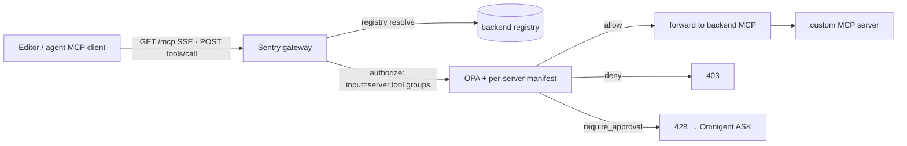

# ADR-0002: Custom MCP Server Coverage in Agentic-Sentry

- **Status:** Proposed
- **Date:** 2026-06-28
- **Deciders:** Developer, Platform Architect
- **Consulted / Informed:** Security Working Group, Platform Team
- **Tags:** platform, security, mcp, gateway, opa, policy

---

## Context

[Agentic-Sentry](../../Agentic-Sentry) is the MCP **policy gateway** — one of the two
enforcement planes (with the native `opa_delegate` hook) that share the one Rego bundle
`mcp_auth.rego`. Its promise is **direct-editor governance**: a developer adds the gateway
as their MCP server (Cursor / Gemini / Codex / Claude), and every `tools/call` is
authorized by OPA before it reaches a real tool.

Today (v1) that promise is **half-built**, and custom (arbitrary) MCP servers are not yet
coverable:

- `GET /mcp` returns **405** (`cmd/gateway/main.go:92`, "SSE not implemented in v1") — MCP Streamable-HTTP clients can't open the channel.
- `tools/list` returns a hardcoded **empty `[]`** (`cmd/gateway/main.go:188`) — editors that add the gateway see **zero tools**.
- Backend resolution is **env-only / partly hardcoded** (`internal/proxy/backend.go ResolveBackend`) — there's no registry for custom servers. (The single-backend forward primitive `internal/proxy/forward.go:12 ForwardToolsCall` *does* exist.)
- The OPA bundle (`mcp-policies/policies/mcp_auth.rego`) is `default allow := false` / `default verdict := "deny"` with **hardcoded per-server allowlists** (`safe_tools` / `operator_allowed_tools`, keyed to `github`/`weather`/`ard`/`sqlite`/…) — so a newly-registered `server_name` hits the **default deny**.

We need custom MCP servers to be **coverable** by Sentry — both *reachable* through the
gateway and *authorizable* by policy — without ever weakening the fail-closed guarantee.

---

## Decision

Cover custom MCP servers via a **deliberate two-layer split**: **reachability** (the proxy)
is separate from **authorization** (the policy). Neither alone makes a custom server
usable; both are required, and the gateway is **safe (default-deny) until both land**.

### Layer 1 — Reachability (the proxy) — **CLO-28**
Generalize the existing single-backend forward into:
- a **config-driven backend registry** (name → URL / transport / auth) for arbitrary custom servers;
- a **Streamable-HTTP / SSE transport** (`GET /mcp`) so MCP clients connect;
- **`tools/list` aggregation** from the registered backends (surface the catalog);
- **authorized routing** of `tools/call` to the right backend (extend `ForwardToolsCall`), preserving the tri-state (allow→forward, deny→403, require_approval→428) and fail-closed.

### Layer 2 — Authorization (the policy) — **new work item**
Replace the hardcoded per-server allowlists with **per-server tool manifests**: each
registered server declares its tools + read/write capability, consumed by the OPA bundle.
Unknown / unregistered / un-manifested servers stay **default-deny**.

### Principles
- **OPA decides**; the gateway never authorizes by itself.
- **Fail closed:** OPA unreachable, or server unknown / un-manifested → **deny**.
- A registered-but-not-policy-covered server is **forwarded-then-denied** (visible in the decision log), **never silently exposed**.
- The two layers ship **independently**; the feature is "done" only when both land.

---

## Consequences

- **Positive:** any custom MCP server can be governed by one policy plane; editors get a working tool catalog; the manifest model scales beyond hardcoded rego allowlists; the design reuses the existing forward primitive (smaller than a from-scratch proxy).
- **Negative / cost:** two work items must both land before the feature is usable; per-server manifests add a registration step; the Streamable-HTTP transport adds gateway complexity.
- **Risk (accepted):** a registered server with no manifest is unusable (default-deny) until covered — safe, but a UX wrinkle (register **and** declare).

---

## Alternatives considered

1. **Proxy-only, no policy model** — forwards custom-server calls, but they all default-deny → useless. *Rejected.*
2. **Default-allow for registered servers** — violates fail-closed; a registered server could expose destructive tools unpoliced. *Rejected.*
3. **Keep hardcoded per-server allowlists in Rego** — every new server is a Rego edit; doesn't scale to arbitrary custom servers. *Rejected in favor of manifests.*
4. **No gateway proxy — editors call backends directly + `opa_hook`** — only works for editors with a native `PreToolUse` hook; misses MCP-only and native-tool agents. *Complementary, not a replacement.*

---

## References

- **CLO-28** — v2 backend MCP proxy (Layer 1).
- *(to file)* — per-server tool manifests / registered-server policy posture (Layer 2).
- Code: `Agentic-Sentry/cmd/gateway/main.go:92,188` · `internal/proxy/forward.go` · `internal/proxy/backend.go` · `mcp-policies/policies/mcp_auth.rego`.
- [Governed-platform architecture](architecture/governed-platform-architecture.md) · [Getting started](../GETTING_STARTED.md) · [ADR-0001](adr-0001-ard-private-hosting.md).
