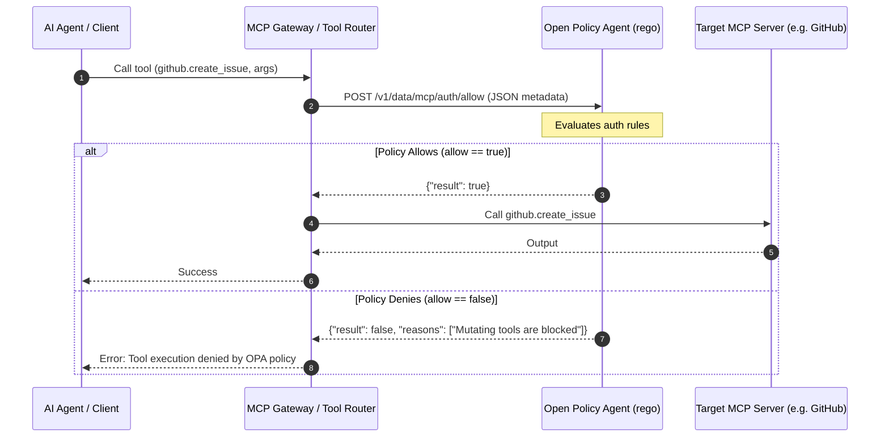

# Securing Agents with Open Policy Agent (OPA) 🛡️👮

You can use **Open Policy Agent (OPA)** to enforce deterministic, fine-grained access control on what tools an agent is allowed to execute. By intercepting MCP (Model Context Protocol) tool requests and routing them through OPA before execution, you can guarantee that agents only perform safe, non-mutating operations.

---

## 1. Architectural Flow

To secure your agentic tools, you insert an authorization proxy (or middleware) within your **MCP Gateway** or **Tool Router** to validate every tool call against OPA before forwarding it to the target MCP server.



---

## 2. Defining Policies in Rego

OPA uses a declarative query language called **Rego**. Below is a policy configuration (`mcp_auth.rego`) that blocks write operations on GitHub and prevents database mutation queries on SQLite.

```rego
package mcp.auth

# Default behavior: block everything unless explicitly allowed (secure-default)
default allow = false
default reason = "Unauthorized tool execution"

# Define safe read-only prefixes for tools
read_only_prefixes := ["get_", "list_", "search_", "read_", "view_"]

# Rule 1: Allow any tool with a safe prefix
allow {
    some prefix in read_only_prefixes
    startswith(input.tool_name, prefix)
}

# Rule 2: Explicitly block destructive or mutating words (defense-in-depth)
allow {
    # Fail if tool name contains mutating verbs
    mutating_verbs := ["create", "delete", "update", "merge", "write", "push", "post", "patch"]
    not contains_any_verb(input.tool_name, mutating_verbs)
    
    # Safe list of explicit tool exceptions
    safe_tools := {
        "github": ["get_repo", "get_issue", "list_pull_requests"],
        "weather": ["get_forecast"]
    }
    safe_tools[input.server_name][_] == input.tool_name
}

# Rule 3: Inspect arguments for SQL injection or database writes
allow {
    input.server_name == "sqlite"
    input.tool_name == "execute_query"
    
    # Force lowercase comparison
    sql := lower(input.arguments.sql)
    
    # Allow only SELECT statements
    startswith(sql, "select")
    
    # Prevent common data modification operations
    not contains(sql, "insert")
    not contains(sql, "update")
    not contains(sql, "delete")
    not contains(sql, "drop")
    not contains(sql, "alter")
    not contains(sql, "create")
}

# Helper: check if string contains any word in a list
contains_any_verb(str, list) {
    some verb in list
    contains(str, verb)
}
```

---

## 3. Tool Router Integration (Python)

In your tool router/harness runtime, wrap the MCP execution logic with an OPA HTTP client check:

```python
import httpx
from typing import Dict, Any, Tuple

OPA_URL = "http://localhost:8181/v1/data/mcp/auth"

async def check_opa_policy(server_name: str, tool_name: str, arguments: Dict[str, Any], agent_role: str) -> Tuple[bool, str]:
    """Queries OPA policy engine to authorize the tool call.
    
    Returns a tuple of (allowed, reason).
    """
    payload = {
        "input": {
            "server_name": server_name,
            "tool_name": tool_name,
            "arguments": arguments,
            "agent_role": agent_role
        }
    }
    
    try:
        async with httpx.AsyncClient() as client:
            response = await client.post(f"{OPA_URL}/allow", json=payload, timeout=2.0)
            
            # Default to secure deny if we get an invalid response
            if response.status_code != 200:
                return False, "OPA server error"
                
            is_allowed = response.json().get("result", False)
            
            # Fetch reason if denied
            if not is_allowed:
                reason_resp = await client.post(f"{OPA_URL}/reason", json=payload)
                reason = reason_resp.json().get("result", "Denied by security policy")
                return False, reason
                
            return True, "Approved"
            
    except Exception as e:
        # Default-Deny: if OPA is unreachable, block the tool call
        return False, f"Policy Engine unreachable: {str(e)}"
```

---

## 4. Operational Setup

To run this policy engine locally or inside your virtual cloud private network:

1.  **Run OPA in a Docker Container:**
    ```bash
    docker run -d --name opa -p 8181:8181 openpolicyagent/opa run --server
    ```
2.  **Upload the Policy:**
    Upload your `mcp_auth.rego` policy file to the OPA server using curl:
    ```bash
    curl -X PUT --data-binary @mcp_auth.rego http://localhost:8181/v1/policies/mcp_auth
    ```
3.  **Test a Violation:**
    Verify that OPA blocks a write operation (`github.create_pull_request`):
    ```bash
    curl -s -X POST -d '{
      "input": {
        "server_name": "github",
        "tool_name": "create_pull_request",
        "arguments": {"title": "Malicious PR"},
        "agent_role": "assistant"
      }
    }' http://localhost:8181/v1/data/mcp/auth
    ```
    Output:
    ```json
    {"result": {"allow": false, "reason": "Unauthorized tool execution"}}
    ```
