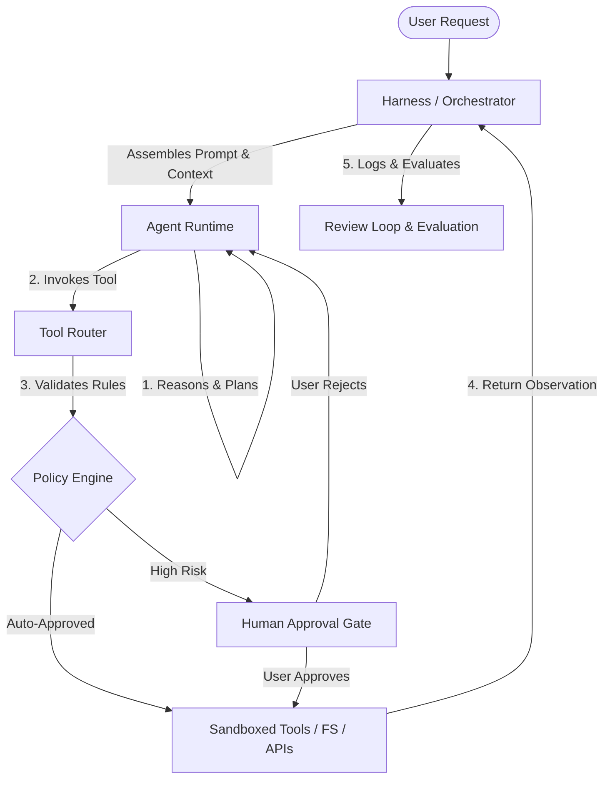

# Building Agentic Workflows: A Practical Primer 🤖🚀

This primer is a practical guide for developers, product managers, and teams looking to integrate agentic workflows into their daily engineering and product processes. 

---

## 1. Assistant vs. Agentic Workflows

Understanding the boundary between an *AI Assistant* (Q&A) and an *AI Agent* (workflow-driven) is key to setting correct operational expectations.

| Dimension | Assistant Workflow | Agentic Workflow |
| :--- | :--- | :--- |
| **Behavior** | One-off, Q&A interaction. | Iterative loop (Reason $\rightarrow$ Act $\rightarrow$ Observe). |
| **Tool Execution** | Human copy-pastes outputs and executes commands. | Agent executes tools directly (shell, git, files, APIs). |
| **State & Memory** | Ephemeral, restricted to the active chat session. | Durable logs, workspaces, checkpoints, and memory. |
| **Outcomes** | Advice, boilerplate, suggestions, text drafts. | Finished PRs, verified test suites, triaged tickets. |
| **Risks** | Immediate hallucinations (visible to human writer). | Silent drift, stale policy enforcement, unowned updates. |

---

## 2. The Anatomy of an Agentic Harness

An **Agentic Harness** is the runtime architecture that controls, steers, and observes an agent. It provides a structured, sandboxed environment for execution and ensures safety boundaries are enforced.



### The Core Components
1. **The Orchestrator:** Manages the task lifecycles, parses requests, and constructs the initial prompt.
2. **Context Builder:** Pulls workspace files, repository structure, and user instructions into the active context.
3. **The Agent:** The LLM reasoning engine that loops through decisions.
4. **Tool Router & Policy Engine:** Executes capabilities (editing files, running tests, web searches) after verifying they don't violate safety policies (e.g., denying unapproved network requests or file deletion).
5. **Review Loop / Evaluator:** Inspects the final state and gathers metrics (correctness, cost, latency, reliability).

---

## 3. Steering Agents in Your Project

To prevent instruction drift across different coding tools (Claude Code, Gemini CLI, Cursor, Windsurf, Cline), this repository provides a fanning-out system via the `air agents` command (in the [`air`](../air/) CLI; symlinks on macOS/Linux, copies on Windows automatically).

### Setup and Instruction Syncing
By fanning out rules from a single source of truth, you ensure every AI assistant or agent that enters your repository adheres to the same guidelines.

1. **Seed the Configuration:** Edit [AGENTS.template.md](../templates/AGENTS.template.md) to set repo-specific styling and coding standards.
2. **Bootstrap Voice & Opinions:** Run `air agents link` with the `--stubs` flag to create your personal voice and opinion guides from [voice.template.md](../templates/voice.template.md) and [opinions.template.md](../templates/opinions.template.md).
   ```bash
   air agents link --all --stubs
   ```
3. **Fanning Out:** `air agents` automatically links the unified instructions (`AGENTS.md`) to:
   * `CLAUDE.md` (Claude Code)
   * `GEMINI.md` (Gemini CLI)
   * `.github/copilot-instructions.md` (GitHub Copilot)
   * `.cursor/rules/agents.mdc` (Cursor)
   * `.windsurf/rules/agents.md` (Windsurf)
   * `.clinerules/agents.md` (Cline)

> [!TIP]
> Always commit the symlinks to your Git repository. If working on Windows or within CI/CD pipelines where symlinks are not preserved, run the script with the `--copy` flag to write physical file copies instead.

---

## 4. Operation: Care, Feeding & Ownership

The moment an agent shifts from a personal toy to a teammate, it requires operational ownership.
Refer to [agent_ownership_playbook.md](agent_ownership_playbook.md) for full details, but keep these four principles in mind:

### 1. Give it a Job
If you cannot explain the agent's job in a single sentence, it is too vague.
* **Bad:** "Make me more productive in backlog management."
* **Good:** "Prepare a weekly sprint refinement packet detailing ticket candidate suggestions based on the PRD, latest design files, and Jira tickets."

### 2. Control its Diet
Agents eat context. A bloated or stale context leads to rotted outputs.
* Clean up your repositories. Keep PRDs, design briefs, and templates up to date.
* Provide high-quality examples of output templates in the agent's instructions directory so it learns correct patterns.

### 3. Establish Boundaries
Risk shifts dramatically as you give agents write and execution capabilities. Use the permission staircase:
* **Level 1 (Read-Only):** The agent reads files and outputs text inside a chat sandbox.
* **Level 2 (Draft-Only):** The agent writes draft files or prepares draft pull requests but cannot merge.
* **Level 3 (Action / Execution):** The agent runs code execution tests, writes directly to systems of record, or responds to customers (requires strict gate/review logic).

### 4. Implement a Review Loop
A loop ensures work comes back around. Run, review, improve, and run again.
* Track agent failure modes (e.g., hallucinating dependencies, using old design references).
* Regularly update instructions, refactor context sources, and check results post-execution.

---

## 5. Five-Step Quick-Start for Teams

Ready to introduce agentic workflows to your project? Follow this checklist:

* [ ] **Identify the Loop:** Pick one repetitive, context-rich task (e.g., PR code review, onboarding doc updates, unit test coverage generation).
* [ ] **Sync Repo Instructions:** Initialize the instructions for your project. Run `air agents link --all --stubs` to populate the `AGENTS.md`, `voice.md`, and `opinions.md` templates.
* [ ] **Complete the Owner's Card:** Create an Agent Owner's Card (using the template in [agent_ownership_playbook.md](agent_ownership_playbook.md)) defining who is operationally responsible for the agent's results.
* [ ] **Configure the Workspace Sandbox:** Ensure the agent is executed in a controlled, sandboxed environment (using tool routers and git status checkpoints).
* [ ] **Schedule the Audit:** Set a calendar reminder (e.g., every sprint retro) to review agent outcomes, adjust its rules, and update stale inputs.
