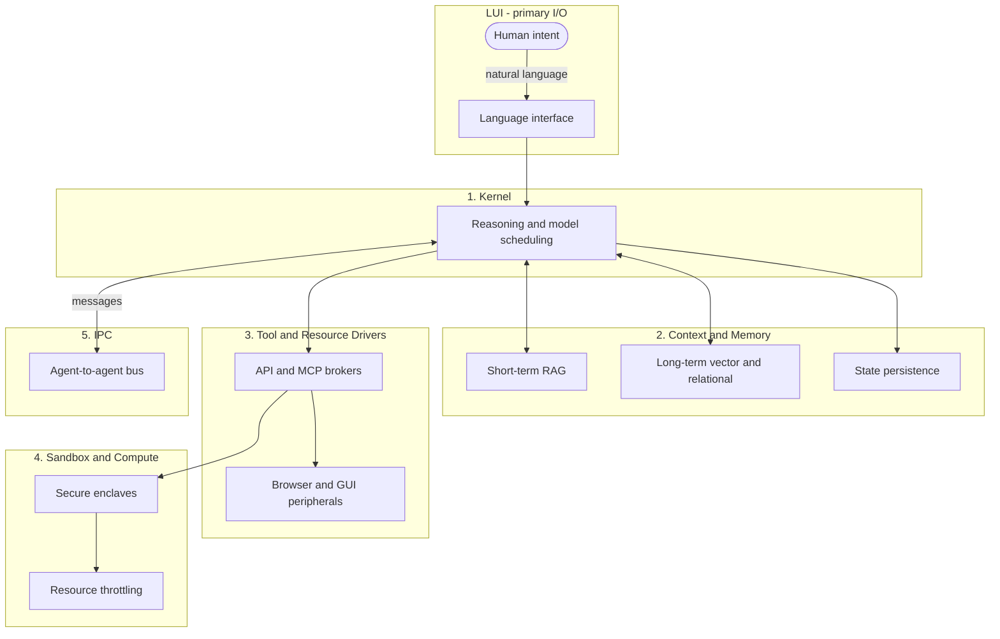

# AOS Conceptual Architecture vs. the air Ecosystem

> **Note:** Merged from `aos/docs/` (Phase 0). The `aos` repo is slated for archive; pillar mapping remains reference. Runtime ownership → [consolidation-plan.md](consolidation-plan.md).

The **Agent Operating System (AOS)** describes a full-stack runtime: a reasoning kernel, durable memory, tool drivers, compute sandboxes, and inter-agent IPC, with **Language UI (LUI)** as the primary human interface. The **air ecosystem** is a contract-driven composition of independently shippable repos centered on `agentic-harness` (`air` CLI + manifest). air already covers orchestration, policy, discovery, optimization, observability, and output contracts—but it delegates LLM execution to external harnesses (Cursor, Claude Code, Copilot, Gemini) rather than hosting a native kernel. The `aos` repo is an empty placeholder today; the mapping below shows where air pieces land against the five AOS pillars and what remains to build.

---

## Conceptual AOS architecture

AOS organizes agent runtime concerns into five pillars plus a human-facing I/O layer:

| Pillar | Responsibility |
| :--- | :--- |
| **1. Kernel** | LLM reasoning and planning, goal decomposition, dynamic model scheduling |
| **2. Context & Memory** | Short-term context (RAG), long-term stores (vector + relational), session/state persistence |
| **3. Tool & Resource Driver Layer** | API brokers, MCP/tool routing, peripherals (browser, GUI automation) |
| **4. Sandbox & Compute** | Secure execution enclaves, resource throttling, isolation boundaries |
| **5. Inter-Agent Communication (IPC)** | Agent-to-agent protocol or message bus |
| **LUI (cross-cutting I/O)** | Natural-language as the primary interface; structured output beneath |

---

## Mapping by AOS pillar

| AOS Pillar | air Component(s) | Repo(s) | Status | What it does today | Gap to full AOS vision |
| :--- | :--- | :--- | :--- | :--- | :--- |
| **1. Kernel** | CO orchestration, task classifier, role dispatch, per-role model selection, hill-climb refinement loop | `copilot-role-router` | **Partial** | CO is the sole user-facing entry; classifies requests, delegates to six specialist roles (Recon, Medic, Engineer, QA, Judge, Scribe), enforces Judge/Scribe gates, persists hill-climb budget in `.role-router/state.json`. Runs as harness plugins (Cursor, Claude Code, Copilot, Gemini, Antigravity)—the underlying LLM is always the host editor's model, not an air-owned runtime. | No standalone reasoning kernel: no native planner, no cross-session goal graph, no dynamic model scheduler owned by air. Classification is documented as weak; there is no unified task/goal API. |
| **1. Kernel** (composition) | `air` CLI, harness manifest, persona/pod scaffolding, orchestration pattern docs | `agentic-harness` | **Partial** | Bills-of-materials manifest (`harness.manifest.yaml`), team profiles, `air bootstrap`/`install`/`personas`, pod-bundle skills and nine persona packs. Documents patterns (hill-climb, fan-out, ToT) but does not execute them as a runtime. | Composition hub, not a kernel. `air install` still prints a plan—provider execution is not implemented. |
| **1. Kernel** | — | `aos` | **Missing** | Empty git repo (Cloud-Byte-Consulting/aos). Intended home for AOS-native kernel work per naming; no code. | Entire native kernel layer unbuilt. |
| **2. Context & Memory** | Transparent LLM proxy, cache-safe compression foundations, CCR (content-addressed retrieval), metadata telemetry | `Cachy` | **Partial** | Go proxy for OpenAI/Anthropic-compatible traffic; live-zone detection, native compressors, CCR store, WASM plugin host—all implemented as libraries/CLI. **Live proxy path is pass-through only** (`io.Copy`); compression/CCR not wired into the request flow. | No RAG pipeline, no vector or relational memory, no cross-agent memory graph. Optimizes *in-flight* context cost, not durable recall. |
| **2. Context & Memory** | Hill-climb / verification state | `copilot-role-router` | **Partial** | Sticky refinement state in `.role-router/state.json` (run budgets, verification IDs). Session-scoped, not shared long-term memory. | Not a memory subsystem—ephemeral orchestration state only. |
| **2. Context & Memory** | Token-efficient structured output (wire + Go library) | `teo` | **Partial** | Line-oriented output format; Go builder/parser/validator; `air` emits TEO by default for CLI output. Reduces context inflation for *emitted* artifacts, not stored memory. | Output contract, not memory. role-router does not yet emit verdicts/dispatch as TEO text. |
| **2. Context & Memory** | — | — | **Missing** | — | Short-term RAG, long-term vector+relational stores, unified state persistence API across agents/sessions. |
| **3. Tool & Resource Drivers** | MCP policy gateway, OPA authorization, OIDC/bearer auth, backend tool forward | `Agentic-Sentry` | **Partial** | Streamable HTTP MCP gateway; every `tools/call` queries OPA (`data.mcp.auth.decision`) before forward. Entra group-RBAC overlay wired. `handleToolsCall` now forwards to a configured backend via `proxy.ForwardToolsCall` (progress since early integration-plan). | Backend routing depends on env/config per server name; ARD-driven dynamic resolution not wired. No browser/GUI peripheral drivers. Gateway is a *policy chokepoint*, not a full driver framework. |
| **3. Tool & Resource Drivers** | Federated discovery spec, conformance CLI, URN identity scheme | `Agentic-Resource-Discovery` | **Partial** | Spec for `/.well-known/ai-catalog.json`, `POST /search`, MCP/A2A/skills catalog entries. Python conformance tooling. **No runnable reference registry** in-repo. | Discovery is spec-only; air does not resolve endpoints at runtime. Peripherals (browser automation, GUI) absent. |
| **3. Tool & Resource Drivers** | MCP config injection, Docker MCP gateway docs, pod-bundle skills | `agentic-harness` | **Partial** | `air bootstrap --policy-gateway` writes editor MCP configs pointing at Sentry (`internal/mcpinject`). Docs for self-hosted Docker MCP gateway. Skills as markdown-invokable capabilities across harnesses. | Injection is opt-in flag, not default bootstrap path. Skills are instruction files, not executable driver adapters. |
| **3. Tool & Resource Drivers** | MCP registration snippets, provider proxy recipes | `Cachy` | **Partial** | Agent integration CLI (Codex/Claude repair/install), MCP endpoint recipes for local LLM backends. | Proxy sits on LLM HTTP APIs, not general tool/peripheral bus. |
| **4. Sandbox & Compute** | WASM plugin host (wazero), default-deny sandbox with memory/time limits | `Cachy` | **Partial** | Optional WASM compressor plugins with bounded host ABI. Not on the live proxy hot path. | Plugin sandbox ≠ agent compute enclave. No cluster/runtime isolation (gVisor/Kata), no CPU/memory/token throttling plane for agent workloads. |
| **4. Sandbox & Compute** | Tool-call authorization boundary, read-only role enforcement (in progress) | `Agentic-Sentry`, `copilot-role-router` | **Partial** | Sentry enforces *what tools may run* via OPA. role-router defines read-only roles (Recon/QA/Judge) and output-guard; shell/bash enforcement gaps were flagged in integration-plan (partially addressed). | Policy sandbox, not execution sandbox. No resource quotas or secure code-interpreter runtime owned by air. |
| **4. Sandbox & Compute** | AgentCube / Kata references in Cordillera skills | `agentic-harness` (pod-bundle skills) | **Missing** (docs only) | Kubernetes skill content describes AgentCube serverless sandboxes and Kata isolation—reference material, not shipped runtime. | No integrated compute layer in any air repo. |
| **5. IPC** | Multi-role delegation, parallel/sequential agent spawn via harness Task/subagent tools | `copilot-role-router` | **Partial** | CO delegates to specialist roles within one user session; harness-native subagent spawning (Cursor Task tool, Claude subagents, etc.). Shared protocol in `AGENTS.md` / `core/*.mjs`. | Intra-session orchestration, not a general inter-agent bus. No cross-process, cross-tenant, or cross-host A2A messaging. |
| **5. IPC** | A2A agent cards in discovery spec; TEO as proposed wire format | `Agentic-Resource-Discovery`, `teo` | **Partial** | ARD catalog entries support `application/a2a-agent-card+json` media types. TEO defined as dense text contract for machine parsing. | No A2A runtime, no message bus, no role-router→teo emission seam (integration-plan Phase 5). |
| **5. IPC** | — | — | **Missing** | — | Dedicated IPC protocol, persistence, routing, and discovery integration for agent-to-agent messages. |
| **LUI (primary I/O)** | CO as sole user-facing role; harness chat/editor surfaces | `copilot-role-router` + host harnesses | **Partial** | Users interact only with CO in natural language; Cursor/Claude/Copilot/Gemini provide the chat UI. Judge/Scribe gates shape what gets returned. | LUI is *borrowed* from third-party harnesses, not an air-native language interface layer. No unified LUI SDK or voice/multimodal stack. |
| **LUI (primary I/O)** | Token dashboard "decision prompt" framing | `token-dashboard` | **Partial** | Local dashboard answers "what should the computer do next?" from measured usage—feedback loop adjacent to LUI, not the interface itself. | Observability companion, not conversational I/O. |

---

## Where agent CLIs fit

The agent CLIs—Claude Code, Codex CLI, Gemini CLI, GitHub Copilot CLI, and Cursor—are the harnesses where LLM reasoning actually runs today. air does **not** own a native kernel; it delegates execution to these CLIs and wraps them. In AOS terms **the CLI is the Kernel runtime**: it hosts the model loop, the agentic plan/act cycle, and the chat surface (LUI). air configures and governs that runtime rather than replacing it.

How much air can wrap depends entirely on the CLI's **auth mode**, because auth determines whether air's optimization/observability layer can sit in the LLM request path.

| Dimension | Subscription mode | API-key mode |
| :--- | :--- | :--- |
| Auth path | Vendor login / OAuth to the vendor's own endpoints | BYO API key to a standard OpenAI/Anthropic-compatible base URL |
| Examples | Claude Pro/Max, ChatGPT/Codex sub, Gemini sub, Copilot sub, Cursor sub | `ANTHROPIC_API_KEY` / `OPENAI_API_KEY` against a configurable base URL |
| Can air sit in the LLM token path? | **No** — the base URL is not redirectable; traffic goes vendor→vendor | **Yes** — point the CLI's base URL at **Cachy** (the transparent proxy) |
| What air can still do | MCP tool config (Sentry), role-router orchestration plugin, log-based token accounting | All of subscription mode **plus** routing token traffic through Cachy for compression, in-path observability, and policy |

The architectural consequence: subscription mode gives air the **tool plane and orchestration plane** but not the **token plane**. API-key mode is the only configuration where air's proxy can intercept the LLM stream itself. Concretely, Cachy ships an integration CLI that rewrites CLI config to redirect the base URL—`cachy integrations claude install` writes `ANTHROPIC_BASE_URL` into `~/.claude/settings.json` (default `http://127.0.0.1:8787`), and `cachy integrations codex install` writes a `[model_providers.cachy]` block with `base_url` + `env_key = "OPENAI_API_KEY"` into `~/.codex/config.toml`. Both support `install` / `repair` / `uninstall` and dry-run, and preserve a user-set base URL if one already exists.

### CLI concern → AOS pillar

| CLI concern | Mechanism today | AOS pillar(s) | Repo(s) |
| :--- | :--- | :--- | :--- |
| LLM reasoning runtime | The CLI's own model + agent loop | **1. Kernel** | host harness (Claude Code, Codex, Gemini, Copilot, Cursor) |
| Base URL / token proxy | `ANTHROPIC_BASE_URL` / `model_providers.*.base_url` → Cachy (API-key mode only) | **2. Context & Memory** (in-flight cost) + Observability | `Cachy`, `token-dashboard` |
| MCP server config | `air bootstrap --policy-gateway` (`internal/mcpinject`) writes editor MCP config → Sentry | **3. Tool & Resource Drivers** | `agentic-harness`, `Agentic-Sentry` |
| Orchestration / governance | role-router CO protocol runs *inside* the CLI as plugins/subagents | **1. Kernel** orchestration + **5. IPC** | `copilot-role-router` |

Note the two planes are orthogonal. The Sentry MCP gateway sits on the **tool plane** (`tools/call` authorization); Cachy sits on the **token plane** (the LLM HTTP stream). A CLI can run in subscription mode (vendor tokens) while still routing its MCP tool calls through Sentry—the auth-mode constraint applies only to the token plane.

### What works today vs. gap

The API-key + Cachy base-URL redirect is the **intended seam** for pulling token traffic into air's layers, but it is only partially wired.

| Capability | Where | Status | Evidence |
| :--- | :--- | :--- | :--- |
| Redirect a CLI's base URL to a proxy | `Cachy` integrations CLI (`internal/install/claude.go`, `codex.go`) | **Built** | Writes `ANTHROPIC_BASE_URL` / `[model_providers.cachy]`; install/repair/uninstall + dry-run; validates scheme/host |
| Transparent forward of OpenAI/Anthropic traffic | `Cachy` proxy (`internal/proxy/proxy.go`) | **Built** | Single configured `TargetBaseURL` reverse proxy, SSE-aware streaming; protocol-agnostic pass-through |
| Compression / CCR on the live path | `Cachy` proxy | **Missing** | Live path is `io.Copy` pass-through (`upstream.go`); compressors/CCR exist only as libraries/CLI, not in the request flow |
| In-path token observability | `Cachy` proxy telemetry | **Partial** | Proxy records latency/status/error-kind per request; no token-count extraction and no feed into `token-dashboard` yet |
| Exact token accounting | `token-dashboard` | **Built** (log-based) | Parses `~/.claude/projects/**/*.jsonl` and `~/.codex/sessions/**/*.jsonl`—independent of auth mode or the proxy |
| air auto-configures CLI base URLs | `agentic-harness` bootstrap | **Missing** | `mcpinject` writes *only* MCP gateway config; base-URL wiring lives in Cachy's CLI, not `air bootstrap` |

Two honest caveats correct a tempting assumption. First, **`air` does not set CLI base URLs anywhere**—`air bootstrap` only injects MCP (tool-plane) config; the base-URL redirect is a separate, manual `cachy integrations …` step. Second, **token observability does not actually require API-key mode**: `token-dashboard`'s exact lane reads Codex/Claude Code session logs straight off disk, so it works under subscription auth too. API-key + Cachy is what unlocks *in-path* optimization (compression) and token-stream policy—not basic cost visibility. And even that is aspirational until Cachy's live path moves past `io.Copy`.

---

## air components NOT in the user's five pillars

air's documented stack (`docs/the_agent_harness_stack.md`, `harness.manifest.yaml`) adds cross-cutting layers that do not map 1:1 onto the five AOS pillars:

| air Layer | Repo | AOS relationship | Role today |
| :--- | :--- | :--- | :--- |
| **Discovery** | `Agentic-Resource-Discovery` | Spans pillars 3 & 5 | Federated catalog + search for MCP, A2A, skills, APIs. Feeds tool drivers and future IPC endpoint resolution. Spec + conformance; no live registry. |
| **Policy / Security** | `Agentic-Sentry` | Cross-cutting (pillars 3 & 4) | OIDC + OPA MCP gateway—the authorization plane every tool call should traverse. Distinct from execution sandboxing. |
| **Optimization** | `Cachy` | Adjacent to pillar 2 | In-flight token/context cost reduction. Not memory, but reduces what enters the context window. |
| **Observability** | `token-dashboard` | Cross-cutting | Three-lane local cost measurement (exact / activity / estimate). Honest usage feedback; no sibling-ingestion seam from role-router or Cachy yet. |
| **Output** | `teo` | Adjacent to pillar 2 & 5 | Standardized dense output grammar—the wire contract for agent results. Only sanctioned Go code dependency (`air → teo`). |
| **Orchestration / Governance** | `copilot-role-router` + pod-bundle | Implements pillar 1 & 5 partially | CO protocol, roles, gates, Pods/skill-routing as governance primitive across the stack. |
| **Composition / Packaging** | `agentic-harness` | Meta-layer above all pillars | Manifest BOM, `air` CLI lifecycle, persona packs, team operating models (A/B/C), bootstrap wiring. Never imports sibling runtime code except `teo`. |

---

## Reverse mapping: air repo → AOS pillars

| Repo | Primary AOS pillar(s) | Secondary / cross-cutting |
| :--- | :--- | :--- |
| `aos` | 1 (intended kernel home) | — |
| `agentic-harness` | Meta/composition | 1 (patterns), 3 (MCP inject), LUI (harness bootstrap) |
| `copilot-role-router` | 1, 5 | LUI (CO entry), 4 (mutation policy) |
| `Agentic-Sentry` | 3, 4 | Policy cross-cut |
| `Agentic-Resource-Discovery` | 3, 5 | Discovery cross-cut |
| `Cachy` | 2, 4 | Optimization cross-cut, 3 (LLM proxy path) |
| `teo` | 2 (output shape), 5 (wire format) | Output cross-cut |
| `token-dashboard` | — (observability) | Informs LUI/decisions indirectly |

---

## Framework positioning

**LangGraph** and **CrewAI** are application-level orchestration frameworks—they own graph/state-machine workflow and multi-agent role assignment inside a Python (or similar) process. air does not embed them; **`copilot-role-router`** plays a comparable *governance* role (CO, gates, hill-climb) but runs as harness-native hooks across editors rather than as an in-process graph runtime. **MCP** is air's de facto tool wire protocol: Sentry gates MCP `tools/call`, ARD catalogs MCP server cards, Cachy registers MCP endpoints for local LLMs, and `air bootstrap --policy-gateway` points editor MCP clients at Sentry. **A2A** is specified in ARD (agent card media types) but has no air runtime yet—future IPC would likely compose ARD discovery + an A2A (or TEO-over-HTTP) transport rather than replacing MCP for tools. LangGraph/CrewAI could consume air services (Sentry gateway, Cachy proxy) as infrastructure; they are not competitors to the manifest/composition model.

---

## Recommended repo strategy

**Keep in `agentic-harness`:** the composition plane—`harness.manifest.yaml`, `air` CLI (bootstrap, install plan, personas, skills link/sync, MCP inject), pod-bundle content, stack documentation, team profiles, and cross-repo integration plans. This repo should remain the *installer and contract hub* that binds independently versioned components without importing their runtime code (except `teo`).

**Evolve `aos` into:** the AOS-native runtime layer that does not belong in the harness hub—specifically the missing **kernel** (planner, goal store, model scheduler), **memory services** (RAG + durable stores), **IPC bus**, and optionally a **first-class LUI adapter** if not satisfied by harness delegation. Start with architecture ADRs and thin interfaces that call existing air services (Sentry for tools, ARD for discovery, Cachy for optimization) rather than re-implementing them.

**Stay in sibling repos:** policy (Sentry), discovery spec (ARD), optimization proxy (Cachy), observability (token-dashboard), orchestration protocol (role-router), output grammar (teo)—each independently shippable, composed by manifest URN (`urn:air:cbc:*`).

---

## Open gaps / next integration seams

Pulled from `agentic-harness/docs/integration-plan.md` (2026-06-23), updated where code has moved since:

| Seam | integration-plan status | Current reality (Jun 2026) | Next step |
| :--- | :--- | :--- | :--- |
| **air → teo** | Standalone build broken | **Resolved** — teo v0.1.x published; air uses versioned module with `GOPRIVATE` | Maintain semver; expand TEO emitters |
| **air → Sentry (Seam ①)** | Missing | **Partial** — Sentry in manifest; `air bootstrap --policy-gateway` implements MCP inject; not default | Make gateway injection profile-driven default for operating model C |
| **Sentry → backend MCP proxy** | Stub | **Partial** — `handleToolsCall` forwards via `proxy.ForwardToolsCall` when backend URL configured | ARD-backed dynamic backend resolution; integration tests |
| **Sentry → ARD (Seam ②)** | Missing | **Still missing** — no catalog self-registration, no reference registry | Phase 3: minimal ARD registry + Sentry publisher |
| **air install providers** | Plan-only | **Still plan-only** — `air install` prints resolved plan, does not materialize services | Phase 1: real archive/oci/pipx/binary providers → `~/.air/services/` |
| **role-router → Sentry/OPA** | Missing | **Still missing** — output-guard scans results post-hoc; does not call OPA for tool auth | Clarify boundary (pre-call vs post-result); do not duplicate Sentry |
| **role-router → teo** | Missing | **Still missing** | Phase 5: emit verdict/dispatch as TEO text |
| **role-router → token-dashboard** | Missing | **Still missing** | Phase 5: per-role usage ingestion contract |
| **Cachy → Sentry / compression in path** | Missing / not wired | **Still missing** on hot path; libraries exist | Phase 4: `--compress` in live proxy; policy hook before forward |
| **Cachy → token-dashboard** | Missing | **Still missing** | Phase 5: savings telemetry into daily-burn |
| **Kernel / Memory / IPC / Compute** | Not in integration-plan | **Not addressed** — out of scope for harness integration phases | `aos` repo: ADRs + minimal interfaces |

**Stale integration-plan / stack-doc points to ignore:**

- "Sentry not even in manifest" — **fixed**; `urn:air:cbc:policy:sentry` is in `harness.manifest.yaml`.
- "`air bootstrap` writes no Sentry MCP config" — **partially fixed**; opt-in `--policy-gateway` flag exists (`air/cmd/bootstrap.go`, `internal/mcpinject`).
- "`handleToolsCall` is a stub" — **partially fixed**; forward path exists when backend URL is configured.
- `docs/the_agent_harness_stack.md` §7 still claims Sentry absent from manifest and bootstrap unwired — **doc drift**; reconcile when next editing stack doc.

**Highest-value near-term seams** (from integration-plan, still accurate): (1) policy chokepoint as default bootstrap path + tested backend routing, (2) real `air install` providers, (3) ARD reference registry for discovery-driven tool resolution, (4) Cachy compression on the live proxy path.
