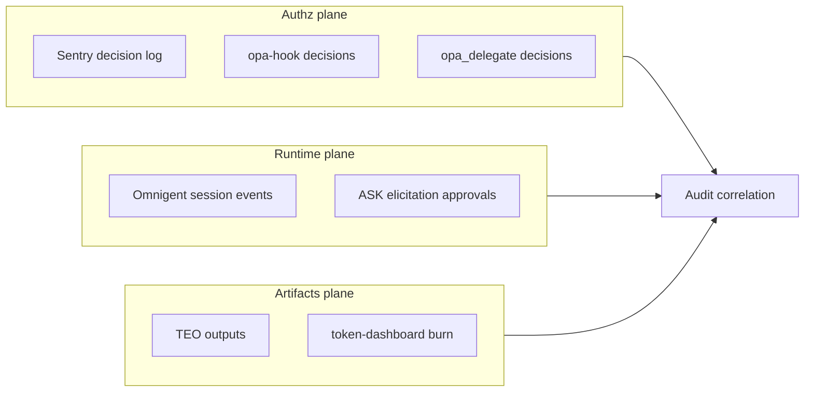

# Policy, OPA hooks, and audit trail

**Status:** Architecture (implementation in Phases 3, 3b, 5).

---

## Authorization split

| Layer | Mechanism | Owner |
| :--- | :--- | :--- |
| MCP `tools/call` | Sentry gateway → OPA `data.mcp.auth.decision` | Agentic-Sentry |
| Native host tools (Bash, `run_command`, file write, …) | `opa_delegate` (Omnigent PreToolUse) or `opa-hook` (editor) → same OPA API | Omnigent + standalone hook CLI |
| Session UX (pause, ask, elicit) | Omnigent ASK / policies engine | Omnigent |
| **Security allow/deny** | **OPA/Rego only** | Shared policy bundle |

**Banned for security gates:** LLM `PromptPolicy`, role-router output-guard as authorization, heuristic “is this safe?” model calls.

> **Empirical support for the ban:** LLM-judged selection is manipulable by prompt injection — *Prompt Injection in Automated Résumé Screening* (arXiv 2606.27287, 2026) shows injected self-promotional text reliably distorts LLM rankings (a single bare *descriptive* injection: DeepSeek +4.16 avg rank / **86.2% success**; an *instructive* injection flips otherwise-immune GPT-4o-mini to **59.7%**), and in mixed-quality pools it **inverts** quality-based selection — injected *lower*-quality résumés outrank genuine *higher*-quality ones (LQ 93.2% vs HQ 79.0% success). An LLM may *propose*; the deterministic OPA decision *authorizes*.

Policy bundle version is stamped on every OPA decision (supply-chain audit via Rego CI).

**Deploy coupling (operational):** ship the OPA bundle and the Sentry gateway (+ `opa_delegate` / `opa-hook`) **together** — they share one Rego contract. A gateway pointed at a stale OPA that lacks a newer rule silently degrades to the boolean `allow` (losing the tri-state verdict and the OE boundaries). Pin the bundle digest to the gateway image, and fail readiness if the live bundle's stamped version is older than the gateway expects.

---

## Sentry MCP-only gap

Sentry only sees MCP `tools/call`. Host-native tools bypass the gateway unless bridged.

**Close the gap:**

1. **`opa_delegate`** — Omnigent `native_policy_hook.py` (PreToolUse) evaluates the same Rego as Sentry before native tool execution.
2. **`opa-hook`** — Standalone CLI for editors without Omnigent session wrapper (Claude Code, Copilot, Antigravity `hooks.json`). **Built (Phase 3b):** `agentic-harness/tools/opa_hook.py` — queries `oe_decision`, maps deny→deny / require_approval→ask, mode-gated, fail-closed. Setup: [opa-hook.md](opa-hook.md).

Both call the same OPA sidecar / bundle as Sentry. One policy, multiple enforcement points.

---

## Editor hooks matrix

| Host | Hook mechanism | Notes |
| :--- | :--- | :--- |
| Omnigent-wrapped sessions | PreToolUse → policies/evaluate | Primary path |
| Claude Code / Copilot | PreToolUse via hook config | `opa-hook` |
| Antigravity (Gemini CLI) | `PreToolUse` in `hooks.json` (platform) vs Gemini CLI `BeforeTool` in `settings.json` | **Re-verify agy 2.0** — PreToolUse did not fire on agy 1.0.8 in Omnigent audit |
| MCP-only clients | Sentry gateway only | No native tools |

Reference: `omnigent/omnigent/native_policy_hook.py`, `omnigent/omnigent/antigravity_native_audit.py`, Agentic-Sentry `cmd/gateway/main.go` (`queryOPA`).

---

## Audit trail (three planes)

Correlate on `session_id`, `subject_id`, `request_id`:

| Plane | Source | Primary use |
| :--- | :--- | :--- |
| **Authz** | Sentry + OPA decision log; hook/delegate duplicates | Compliance replay, “who was allowed what tool when” |
| **Runtime** | Omnigent session events, approvals | Operational forensics, human-in-the-loop proof |
| **Artifacts** | TEO exports, token-dashboard | Cost attribution, deliverable provenance |

**Enterprise (Phase 5):** Export authz log schema per [Agentic-Sentry production docs](../../../Agentic-Sentry/docs/production.md); wire Entra subject on Sentry; ship correlation IDs from Omnigent into OPA input.

**Forwarding the authz log (no bespoke shipper):** `OE_AUDIT_LOG` is already a stable JSONL stream (contract-A schema), so shipping it to OTel/SIEM is an ops integration, not new code — point a standard collector (OpenTelemetry Collector `filelog` receiver, Vector, or Fluent Bit) at the file and map it to OTLP / the SIEM. Keep the file local and rotated; the collector owns delivery, backpressure, and retry. A bespoke in-process exporter would re-implement that for no benefit.

**`task_ref → session_id` resolution:** the primary path is the receipt marker in the tracker comment (`oe_correlate.py`, no Omnigent creds). A label-query API on `GET /sessions` (find a session by `openengine.issue`) is a deferred convenience — it would need a `conversation_labels` JOIN across the store interface + every impl for low marginal value, so the marker path stays canonical.

**GTM narrative:** [enterprise-pitch.md](../enterprise-pitch.md).
