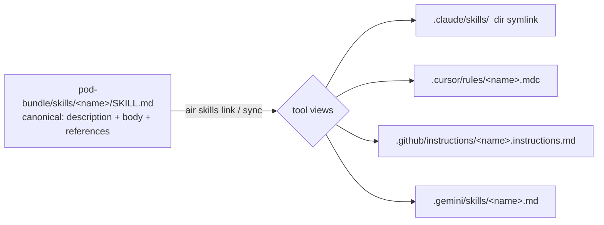

# Cross-Tool Skills 🧠🔁

A skill is just **portable markdown** — a `description` (when to load it) plus a
body (the knowledge/procedure). What differs between AI coding tools is only the
*file location* and the *frontmatter*. So skills live **once**, in a single
canonical folder, and each tool gets a **symlink** (or a generated copy) — you
edit one file, not four.

- **Canonical source:** `pod-bundle/skills/<name>/SKILL.md` (+ `references/`).
- **Tool views:** symlinked by `air skills link` or copied by `air skills sync`.
  They are **git-ignored** — recreate them after clone (committed symlinks break
  on Windows; the canonical folder is the only tracked copy).

This page also records the [skill-routing](pods_and_skill_routing.md) contract
update that went with the persona work.

---

## 1. One source, many tools



| Tool | Location | Loading model |
| :--- | :--- | :--- |
| **Claude Code** | `.claude/skills/<name>/SKILL.md` | `description:` — auto-loaded on demand. Same format as canonical → **one directory symlink**, full fidelity (references included) |
| **Cursor** | `.cursor/rules/<name>.mdc` | `description` + `alwaysApply: false` → *Agent-Requested* rule |
| **GitHub Copilot** | `.github/instructions/<name>.instructions.md` | `applyTo:` glob (defaults `**`; narrow per skill). Also reads `AGENTS.md` |
| **Gemini CLI** | `.gemini/skills/<name>.md` (+ `INDEX.md`) | referenced via `@.gemini/skills/<name>.md`, or imported from `GEMINI.md` |

---

## 2. `link` vs `sync`

```bash
air skills list                 # canonical skills + descriptions
air skills link                 # symlink every tool view to pod-bundle/skills (edit once, reflected everywhere)
air skills sync                 # copy instead of symlink (Windows-safe; preserves per-tool frontmatter)
air skills sync --harness claude,copilot   # target a subset (or a named set: --harness frontend)
air skills link --tools claude  # or pick tools directly
```

| | `link` (symlinks) | `sync` (copies) |
| :--- | :--- | :--- |
| **Single source of truth** | ✅ edit canonical, all views follow live | ⚠️ re-run after each edit |
| **Per-tool frontmatter** (Cursor `alwaysApply`, Copilot `applyTo`) | ❌ shared body, canonical frontmatter only | ✅ correct per tool |
| **Windows** | needs Developer Mode / `git config core.symlinks` | ✅ works everywhere |
| **Claude fidelity** (references/) | ✅ full dir | ✅ full dir copy |

**Recommendation:** `air skills link` on macOS/Linux for a true single source;
`air skills sync` on Windows or in CI. Either way, Claude is full-fidelity. Both
are in the cross-platform Go CLI ([`air/internal/skills`](../air/internal/skills/))
with unit + integration tests (frontmatter incl. block scalars, copy, and symlink).

> **Per-tool caveats.** Cursor's *Agent-Requested* model is the closest match to
> Claude's on-demand skills (a `description`-only file works). Copilot has no true
> "skill" concept — narrow `applyTo` per skill domain. Gemini has no auto-trigger;
> reference skills explicitly with `@`. When you need these distinctions, prefer
> `sync` (or hand-tune after `link`).

---

## 3. Skill-routing contract update (v2)

`pod-bundle/contracts/skill-routing.yaml` had drifted; the persona work made the
gaps clear. Fixed in **v2 (2026-06-21)**:

- **Registered present-but-missing skills** — 8 shared (`test-driven-development`,
  `code-review-and-quality`, `documentation-and-adrs`, `planning-and-task-breakdown`,
  `evidence-grounded-investigation`, `co-operating-model`, `frontend-ui-engineering`,
  `idea-refine`) + `mutation-gate`, and the 4 `volcano-*` Team-alpha skills.
- **Added a `personas:` block** — the Tier-1 selector *above* routers: each of the
  9 personas → its routers + skills + default mutation tier (the routing-contract
  view of `pod-bundle/personas/<id>/persona.yaml`).
- **Added a `planned_skills:` registry** — the net-new skills personas reference
  but that aren't authored yet (e.g. `threat-modeling`, `incident-response`,
  `data-pipeline-engineering`), each with owner persona + gate tier, marked
  `status: planned` so the contract and the persona packs stay consistent.

> Authoring a planned skill = create `pod-bundle/.claude/skills/<name>/SKILL.md`,
> run `air skills sync` to project it, then move it from `planned_skills` into the
> owning router block.

---

---

## 4. Portable paths (`${AGENT_WORKSPACE}`)

Some vendored skills reference sibling agent repos (`agent-coordination`,
`team-alpha-agent-system`, `team-beta-agent-system`) as their "source of truth". These
were originally hardcoded to one author's machine (`C:/Users/<name>/workspace/…`),
which is neither user- nor OS-agnostic. They are now written as:

```
${AGENT_WORKSPACE}/agent-coordination/agents/20-mutation-gate.md
```

Set `AGENT_WORKSPACE` to the directory that holds those sibling repos (default to
your workspace root). If you don't have them, the skill bodies are still
self-contained — the reference is supplementary. Re-running `air skills sync`
preserves the placeholder across all projected formats.

> Generic example paths inside skills (e.g. `C:\Windows`, `s3a://bucket/…`,
> `/var/lib/postgresql/data`) are illustrative content, not machine-specific
> references, and are intentionally left as-is.

---

## Related
- [Pods & Skill Routing](pods_and_skill_routing.md) · [Packaging & Persona Packs](packaging_and_personas.md)
