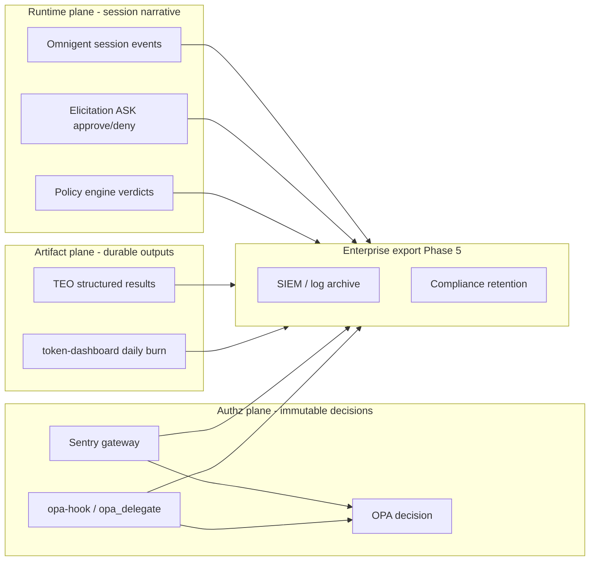

# Enterprise pitch — Governed Agent Platform

**Status:** GTM draft for post-consolidation stack (Omnigent runtime + Sentry/OPA + satellites).  
**Audience:** Platform engineering, security, compliance, FinOps, line-of-business AI programs (e.g. regulated financial services).

---

## One line

**Run AI agents at enterprise scale with the same rigor you apply to identity, audit, and spend — without locking teams into one vendor model or one IDE.**

---

## The problem (30 seconds)

Enterprises are deploying coding agents, copilots, and autonomous workflows faster than governance can keep up. That gap shows up as:

- **Tool sprawl** — MCP servers, native shell/file tools, and vendor APIs with no single authorization model
- **Non-deterministic “policy”** — LLM-judged allow/deny that auditors cannot replay or sign off on
- **Blind spots** — MCP gateways that secure *some* traffic while `Bash`, `run_command`, and direct integrations bypass them
- **Cost opacity** — token burn spread across Claude, Copilot, Cursor, and APIs with no honest measurement or enforcement
- **Fragmented stacks** — orchestration in one product, security in another, observability in a third

Regulated teams need **deterministic policy, identity-bound access, and an audit trail** — without killing developer velocity.

This is the line between **vibe coding** (prompt-and-accept) and **agentic engineering** (AI as an implementation engine inside human-designed constraints, tests, and feedback) — the framing in Google's *The New SDLC with Vibe Coding* (2026). Vibe coding is low-CapEx / **high-OpEx** (rework, incidents, audit gaps); agentic engineering is the CapEx — the governed harness — that drives OpEx down. **Our platform is the harness that makes agentic engineering enforceable.** That paper's own equation — **"Agent = Model + Harness," the model only ~10%** — is the quantified case for investing in the governed harness, not just the model.

---

## The solution

**A governed agent platform** with a deliberate split of ownership:

| Layer | Component | Enterprise value |
|-------|-----------|------------------|
| **Runtime** | Omnigent | Sessions, sandboxes, multi-harness orchestration, human-in-the-loop (ASK) |
| **Policy** | Agentic-Sentry + OPA | **Single authz truth** — Rego, CI-tested, Entra RBAC |
| **Discovery** | ARD | Federated catalog of MCP tools, agents, skills |
| **Cost** | token-dashboard + Omnigent budgets | Measured burn + enforced thresholds |
| **Contracts** | teo | Dense, parseable agent outputs for downstream systems |
| **Optimization** | Cachy (optional) | Token-plane proxy when API-key mode applies |

**Design principle:** Omnigent owns the **session and UX**. **OPA owns every allow/deny.** No LLM judges on security gates.

---

## Enterprise proof points

1. **Identity-native** — OIDC / Microsoft Entra; tool access tied to groups and roles
2. **Deterministic authorization** — Every tool path resolves to a **Rego rule** (versioned, PR-reviewed, `opa test`)
3. **Defense in depth** — MCP via Sentry; native tools via PreToolUse → OPA (`opa_delegate` / `opa-hook`)
4. **Fail-closed** — Policy engine unreachable → **deny**
5. **Audit-ready** — See [Audit trail](#audit-trail-where-it-lives) below
6. **Honest cost governance** — Measured vs estimated lanes; session/daily budgets
7. **Deploy where you operate** — Kubernetes profile, private ARD registry
8. **Harness freedom** — Claude, Codex, Cursor, Copilot, Antigravity — **one policy plane**

---

## Audit trail — where it lives

The audit trail is **not one log file** — it is **correlated events across three planes**, stitched by `request_id`, `session_id`, `subject_id` (Entra OID), and timestamp.

### 1. Authz plane (strongest audit signal) — **Sentry + OPA**

**When:** Every MCP `tools/call` through the gateway; every native tool check via `opa-hook` / `opa_delegate` posting to the same OPA endpoint.

**What to record (per decision):**

| Field | Source |
|-------|--------|
| `timestamp`, `request_id` | Gateway / opa-hook |
| `session_id` | MCP session or Omnigent session id |
| `subject_id`, `subject_email`, `groups` | JWT / session identity |
| `server_name`, `tool_name`, `arguments` (redacted) | OPA input |
| `allow`, `reason` | OPA output |
| `policy_bundle_version` / Rego revision | OPA bundle manifest |
| `client_ip`, `duration_ms` | Gateway |

**Schema:** Recommended JSON line per decision in [Agentic-Sentry/docs/production.md](../../Agentic-Sentry/docs/production.md) (audit log schema). **Phase 5 deliverable:** implement structured decision logging in gateway + opa-hook; ship to stdout / OpenTelemetry / SIEM forwarder.

**Why it matters:** Auditors care about **who tried to do what, was it allowed, and under which policy version**. This is the legal-grade chokepoint record.

### 2. Runtime plane — **Omnigent session events**

**When:** Session lifecycle, tool dispatch, policy ASK/elicitation, sandbox actions, cost budget triggers.

**What to record:**

- Session start/stop, user identity, harness, model
- Policy evaluations (phase, verdict, `deciding_policy`) — deterministic cost/rate/PII only for authz; authz itself references OPA decision id
- **ASK / elicitation:** user approved or refused (human-in-the-loop audit)
- Antigravity-native: permission WAITING steps bridged to web elicitation (who approved `run_command`)

**Export:** Omnigent server telemetry / session API (OTLP where configured). **Phase 5:** normalize to common audit envelope with `session_id` + `subject_id`.

**Why it matters:** Explains **narrative context** — not just “deny create_pr” but “agent was in session X, user was prompted, user refused.”

### 3. Artifact plane — **TEO + cost**

**When:** Agent completes work; daily/hourly burn rolls up.

| Source | Audit use |
|--------|-----------|
| **teo** | Structured verdicts, dispatch plans, evidence blocks — **what was produced**, parseable for replay |
| **token-dashboard** | Exact/activity/estimate lanes — **what it cost**, honest fidelity labels |
| **Cachy** (optional) | Per-request metadata (latency, route) — not primary audit; supplements cost |

**Why it matters:** Compliance and FinOps ask **“show me the output and the spend for this engagement.”**

### 4. Policy supply chain — **Rego CI + bundles**

**When:** Every policy change.

**What to record:**

- `opa test` in CI (pass/fail, commit SHA)
- Bundle publish to Garage/S3 (`bundle.tar.gz` version)
- OPA activation timestamp on sidecar

**Why it matters:** **Prove which rules were in force** when a decision was made (critical for examinations).

---

## Audit correlation (how teams use it)

**Investigation query pattern:**

1. Start from **Sentry decision log** — `allow: false`, `tool_name: run_command`, `subject_email`
2. Join **Omnigent session** — same `session_id` → full tool trajectory, elicitations
3. Join **TEO artifact** — structured outcome of the task
4. Join **token-dashboard** — measured tokens for that UTC day / user
5. Join **policy bundle version** — Rego at decision time

**Retention tiers (enterprise profile):**

| Tier | Data | Typical retention |
|------|------|-------------------|
| Hot | Authz decisions, denials | 90d–1y searchable |
| Warm | Session summaries, TEO artifacts | 1–7y |
| Cold | Daily cost aggregates | 7y+ (FinOps) |

---

## What is built vs planned

| Capability | Today | Phase 5 (enterprise) |
|------------|-------|----------------------|
| OPA Rego + `opa test` | Built | Maintain |
| Sentry audit JSON schema | **Documented** ([production.md](../../Agentic-Sentry/docs/production.md)) | **Implement** structured decision log |
| Native tool OPA path | Planned (`opa_delegate`, `opa-hook`) | Log same schema as MCP |
| Omnigent session export | Partial (telemetry) | Normalized audit envelope |
| TEO artifacts | Built | Index by session id in export |
| token-dashboard | Built | Feed + audit correlation id |
| SIEM pipeline | Not wired | Fluent Bit / OTel → Splunk/DSentra/etc. |

---

## Customer outcomes

- “Every tool call — MCP **and** native — is authorized against **our** Rego, with **our** Entra groups.”
- “Audit asked for deny reasons and policy versions — we have them.”
- “We know what agents cost per team per day, and budgets stop runs before they become incidents.”
- “We didn’t pick one IDE; we picked **one policy plane**.”

---

## Pilot (90 days)

One governed workload (internal knowledge assistant or fraud-explanation workflow):

- Entra-backed Sentry
- Omnigent session server on K8s
- ARD registry for approved MCP tools
- Decision log + session correlation
- token-dashboard feed for cost caps

---

## Taglines

- **“Agents with an audit trail.”**
- **“One policy plane. Any harness.”**
- **“Deterministic gates. Human-speed agents.”**
- **“Govern agent tools like you govern APIs.”**

---

## Related docs

- [Consolidation plan](../../../.cursor/plans/AIR%20Omnigent%20Consolidation-c7d8b160.plan.md) (workspace)
- [architecture/consolidation.md](architecture/consolidation.md) (Phase 0 — when written)
- [Agentic-Sentry production ops](../../Agentic-Sentry/docs/production.md)
- [integration-air-harness](../../Agentic-Sentry/docs/integration-air-harness.md)
