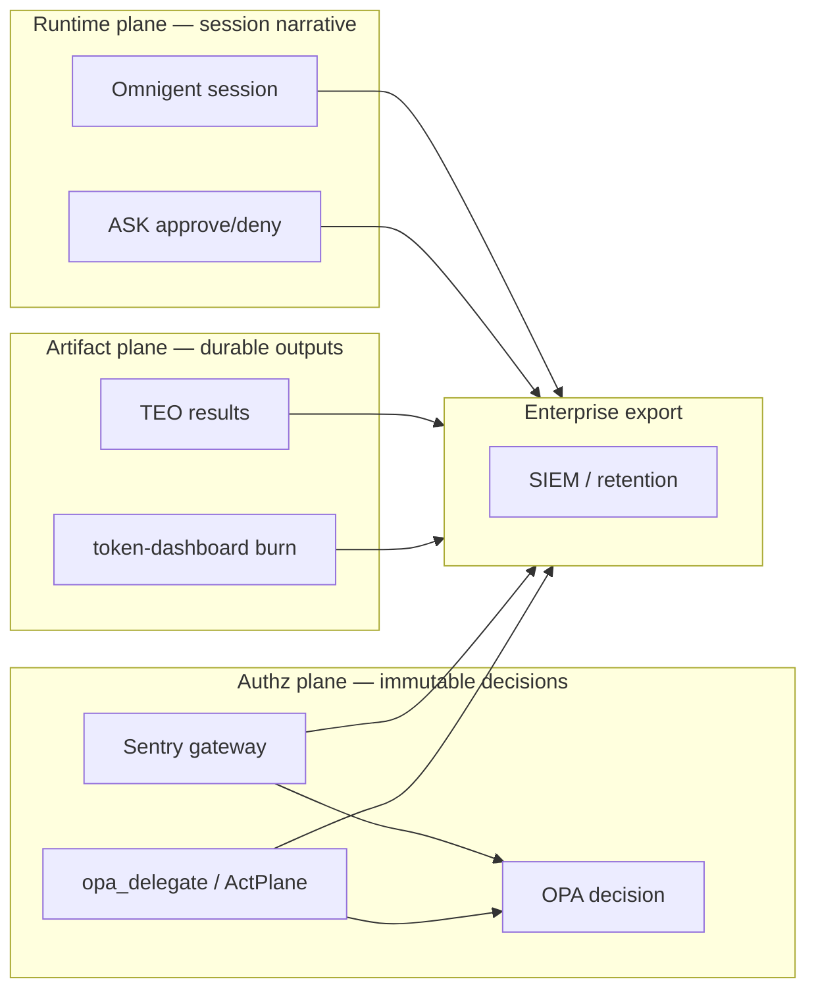

# Open Engine — the Governed Agentic Platform

**One platform, not a toolchain you assemble.**

> The governed agentic platform where orchestration, policy, cost, and audit are **one
> system** — not four products with seams where governance leaks.

**Status:** GTM pitch for the consolidated stack (Omnigent engine + Agentic-Sentry/OPA +
token plane). **Audience:** platform engineering, security, compliance, FinOps, and
regulated line-of-business AI programs (e.g. financial services).
**Start here:** [GETTING_STARTED.md](../GETTING_STARTED.md) · [governed-platform architecture](architecture/governed-platform-architecture.md).

> **Unfamiliar with a term?** Every acronym below — MCP, OPA, Rego, extAuthz, eBPF/BPF-LSM, φ, CapEx/OpEx, RLM, ASK … — is defined in the **[Glossary](../GLOSSARY.md)**.

---

## One line

**Run AI agents at enterprise scale with the same rigor you apply to identity, audit, and
spend — governed by deterministic policy, across any harness, as one integrated system.**

---

## The 30-second problem

Enterprises adopting agentic AI quietly assemble a stack: one tool to orchestrate agents,
another to broker MCP traffic, a third for cost, a fourth bolted on for logging. Each is
bought and wired separately — and the **seams between them are exactly where control
fails**:

- **Tool sprawl** — every agent, MCP server, and model added its own way, with no single choke point.
- **Non-deterministic "policy"** — an LLM that decides whether an action is allowed is *a control that can be talked out of*. Prompt-based guardrails are advisory, not enforced, and an auditor cannot replay them.
- **Blind spots** — a model writes a script, the script runs `git push` / `curl` / `rm`, and your tool-call hooks never saw it. It happened below the layer you were watching.
- **Cost opacity** — token burn spread across Claude, Copilot, Cursor, and APIs that you can estimate but never reconcile.
- **Fragmented stacks** — orchestration in one product, security in another, observability in a third, so the audit story has gaps precisely at the boundaries.

You didn't buy a platform. You bought an **integration project that never finishes** — and
governance leaks through every join. This is the line between **vibe coding**
(prompt-and-accept) and **agentic engineering** (AI as an implementation engine inside
human-designed constraints, tests, and feedback) — the framing in Google's *New SDLC*
(2026). Vibe coding is low-CapEx / **high-OpEx** (rework, incidents, audit gaps); agentic
engineering is the CapEx — the governed harness — that bends OpEx down.

---

## The holistic solution — one platform, five pillars engineered as one

Open Engine is **one integrated platform**, built so five pillars interlock instead of
merely interoperating. **The integration *is* the product.**

- **ENGINE (Omnigent)** — runs governed agent sessions across Claude Code, Codex, Cursor, Pi, and YAML agents. Native-plane `opa_delegate`, a `role_router` supervisor, sandboxes, and human-in-the-loop **ASK** for the actions that warrant a human.
- **POLICY GATEWAY (Agentic-Sentry)** — the MCP plane: OIDC + OPA on **every** `tools/call`, returning tri-state **allow / deny / require_approval**.
- **TOKEN / COST plane** — **Cachy** (LLM context-optimization proxy), **teo** (token-efficient output format), and **token-dashboard** with honest exact / activity / estimate cost lanes.
- **GOVERNANCE** — the principle is **the LLM proposes, OPA decides.** Two enforcement planes — **native** (`opa_delegate`, kernel-backed by ActPlane eBPF) and **MCP** (agentgateway / Sentry) — call **one shared Rego bundle** (`mcp_auth.rego`). Entra groups can only **RELAX** policy, only from cryptographically verified tokens. Everything **fails closed**.
- **HUB (agentic-harness)** — the architecture, the spikes, and the getting-started guide that ties it together.

**Why holistic matters — the spine of this platform.** Competitors hand you orchestration
*or* an MCP broker *or* a cost dashboard, and leave you to glue policy across them. In a
glued stack the native runtime and the MCP gateway enforce *different* rules, drift apart,
and create exactly the gap an agent exploits. Open Engine collapses that gap by design:

- **One policy bundle, two planes.** The *same* `mcp_auth.rego` decides at both choke points — native runtime and MCP gateway. No second policy language, no drift, no "which rule won?"
- **One audit fabric.** Authz, runtime, and artifact events are *correlated*, not merely collected — the join keys are native, not a best-effort stitch across four vendors' schemas.
- **One cost plane.** Optimization (Cachy), output format (teo), and reconciliation (dashboard) are the same system, not three invoices.

---

## Proven, not promised

These are **accepted, Done** spikes (CLO-7…11), not a roadmap:

- **CLO-9 — one bundle, enforced live (the proof the whole pitch rests on).** Our **real production** `mcp_auth.rego` runs through agentgateway's extAuthz → OPA, live: **allow → 200, deny → 403, require_approval → 428**. The native plane (`opa_delegate`) is **built, not planned** — the *same bundle* at both choke points.
- **CLO-10 — the blind spot, closed.** ActPlane eBPF / BPF-LSM enforcement sits *beneath* the native plane and catches **indirect exec** — a `git` / `curl` / `rm` reached via a model-written script — that tool-call hooks miss. Kernel-level, on a BPF-LSM-capable host.
- **CLO-7 — semantic early-stopping.** Embedding-convergence `STOP_CONVERGED`, judge-free: **~38% fewer tokens in the refine loop** — a direct, measured OpEx lever.
- **CLO-11 — governed long-context (RLM).** Opt-in tool with a sub-call fan-out cap, a token-budget gate, and a sandbox. It survived an adversarial review that **found and fixed** a prompt-injection sandbox escape — governance proven under attack, not just on paper.
- **CLO-8 — the formalism.** Agentic-BPM / TDF / FRAME treats execution-admission **φ** as a first-class artifact: the LLM proposes an action; an **OPA decision (φ, not an LLM)** admits it. The decision boundary is formal and inspectable.

---

## The economics — the harness is the asset

**Agent = Model + Harness.** Google's New-SDLC equation puts the model at **~10%** of a
working agent. The other 90% — the harness — is where governance, cost control, and audit
either exist or don't.

| | Vibe coding (prompt-and-accept) | Agentic engineering (governed harness) |
|---|---|---|
| **CapEx** | ~zero — just buy model seats | The harness: policy, cost plane, audit |
| **OpEx** | **High, compounding** — rework, incident response, audit remediation, runaway token spend | **The lever to bend OpEx down** — enforced policy heads off incidents, the cost plane targets waste, audit is a byproduct rather than a project |
| **The asset** | None — you rent the model, and it depreciates the day the next one ships | **The harness compounds** — every policy, approved pattern, and closed audit gap is durable capital |

The model is a *rented commodity*; the **harness is the 90% you own**, and it's where ROI
lives. The platform is the lever on each OpEx driver — and the pilot measures the
movement against *your* baseline (below), rather than us asserting a number:

- **Rework** — policy stops bad actions before they land, not after review.
- **Incidents** — enforcement is deterministic and fail-closed, including the indirect actions tool-hooks miss.
- **Audit cost** — evidence is generated continuously and already correlated, instead of reconstructed under deadline.
- **Token spend** — cost is measured per session, and the refine loop stops when it has *converged*, not when it is exhausted (CLO-7).

**For the CFO / FinOps buyer:** Open Engine is the CapEx line item that bends the agentic
OpEx curve down. You are not buying a smarter model — you are buying the asset that makes
*any* model safe and economical to run at scale.

---

## Governance — no ungoverned path (on a BPF-LSM-capable host)

- **OPA decides, never an LLM.** Every consequential action resolves to a **Rego rule** — versioned, PR-reviewed, `opa test`-gated. An auditor can replay it.
- **Two planes, one bundle.** MCP via Agentic-Sentry; native tools via `opa_delegate`; **indirect exec** (model-written scripts) via ActPlane at the kernel. Same `mcp_auth.rego` throughout — so there is no path that an agent takes which a policy did not decide.
- **Identity-native.** OIDC / Microsoft Entra; tool access tied to groups and roles; groups only **relax** enforcement, only from cryptographically verified tokens.
- **Fail closed.** Policy engine unreachable, missing config, missing cost data, a renamed upstream hook → **deny or bound**, never silently open.
- **Harness freedom.** Claude, Codex, Cursor, Copilot, Pi — **one policy plane**, not one IDE.

---

## Audit — one fabric, three planes

Not one log file — **correlated events across three planes**, stitched by `request_id`,
`session_id`, `subject_id` (Entra OID), and policy-bundle version. When compliance asks
"who did what, under which policy, at what cost, and who approved it?" — that's **a query,
not a quarter-long reconstruction project**.

| Plane | Source | Records | Audit use |
| :-- | :-- | :-- | :-- |
| **Authz** (strongest signal) | Sentry + OPA | `timestamp`, `request_id`, `session_id`, `subject_id`/`groups`, `tool_name`, `arguments` (redacted), `allow`/`reason`, **policy-bundle version** | The legal-grade chokepoint record: who tried what, was it allowed, under which policy version. |
| **Runtime** | Omnigent session | session start/stop, identity, harness, model; **ASK approvals** (who approved a `run_command`) | The narrative — not just "deny create_pr" but "user was prompted and refused." |
| **Artifact** | teo + token-dashboard | structured verdicts/outputs; exact/activity/estimate cost lanes | "Show me the output and the spend for this engagement." |
| **Supply chain** | Rego CI + bundles | `opa test` pass/fail + commit SHA; bundle version; OPA activation time | Prove which rules were in force at decision time. |

**Retention tiers (enterprise profile):** Hot — authz decisions/denials, 90d–1y searchable;
Warm — session summaries + TEO artifacts, 1–7y; Cold — daily cost aggregates, 7y+ (FinOps).

---

## What's built

| Capability | Status |
| :-- | :-- |
| OPA Rego policy bundle + `opa test` | **Built** |
| MCP plane (agentgateway extAuthz → OPA) on our real policy | **Proven live** (CLO-9: 200/403/428) |
| Native-plane OPA gate (`opa_delegate`) | **Built** — same bundle as MCP |
| Indirect-exec enforcement (ActPlane eBPF) | **Spike-proven / staged** (CLO-10, BPF-LSM host) |
| Semantic early-stopping | **Built** (CLO-7) |
| Governed long-context tool (RLM) | **Built, opt-in** (CLO-11) |
| φ execution-admission formalism | **Adopted** (CLO-8) |
| token-dashboard cost lanes | **Built** |
| Structured decision-log → SIEM/OTel export | **Phase 5** (forwarder pipeline) |

---

## The 90-day pilot

A bounded, **measurable** proof that the *integration* holds — not just that each part runs:

- **Days 0–30 — Govern one path.** Put one agent (e.g. Claude Code) behind the Policy Gateway with your real `mcp_auth.rego`; onboard Entra OIDC; stand up the token-dashboard. Demonstrate live allow/deny/require_approval (200/403/428). **Baseline** current per-session token spend and rework rate.
- **Days 31–60 — Two planes, one bundle.** Stand up the native plane (`opa_delegate`) against the *same* bundle; enable ActPlane eBPF on a BPF-LSM host and show an indirect `git`/`curl`/`rm` getting caught; wire ASK. Turn on semantic early-stopping and **measure** token reduction vs baseline.
- **Days 61–90 — One fabric.** Enable the cost plane and the three-plane correlated audit trail. Walk an auditor through a single incident reconstructed from correlated events in minutes; hand FinOps the per-session cost report.

**Exit criteria — what you'll have *measured*, not been promised:** deterministic policy
enforced at both planes, one indirect-exec blind spot closed, a token-reduction number on
your refine loops, and a correlated audit trail you can query. *Pilot ROI figures are
measured against your baseline — we don't invent them for you.* Deploy targets: **Entra
OIDC**, a **Kubernetes** profile, **GitHub** source-of-truth with **Gitea CI**.

---

## Customer outcomes

- "Every tool call — MCP **and** native **and** the script that ran underneath — is authorized against **our** Rego, with **our** Entra groups."
- "Audit asked for deny reasons and policy versions — it was a query, not a project."
- "We know what agents cost per team per day, and budgets stop runs before they become incidents."
- "We didn't pick one IDE; we picked **one policy plane**."

## Taglines

> **One platform, not a toolchain you assemble.**

> **The LLM proposes. OPA decides.**

> **One bundle. Both planes. Fail closed.**

> **The model is 10%. We govern the other 90%. Stop renting risk — own the harness.**

---

## Related docs

- [Getting started](../GETTING_STARTED.md) · [**Glossary**](../GLOSSARY.md) · [Governed-platform architecture](architecture/governed-platform-architecture.md) · [Consolidation plan](architecture/consolidation-plan.md)
- [All-spikes target architecture](architecture/target-architecture-all-spikes.md) · [Securing agents with OPA](agent_security_opa.md) · [Audit correlation design](architecture/audit-correlation-design.md)
- Live proof: [`experiments/cl09-real-policy/`](../experiments/cl09-real-policy/) · [Agentic-Sentry production ops](../../Agentic-Sentry/docs/production.md)
