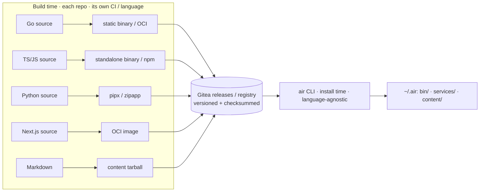
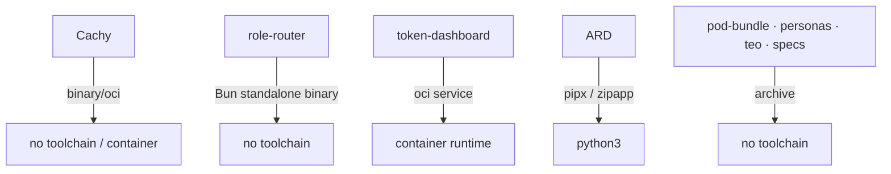

# Packaging the AIR Harness & Persona Packs 📦🎭

The workspace is not one program — it's six independently-versioned components (a Go proxy, a Node/Bun orchestrator, a Next.js dashboard, a Python conformance tool, and two markdown bodies) that together form one **model-agnostic productivity harness**. This page answers two questions:

1. **How do you package polyglot, independently-versioned projects as one harness** without merging them into a monorepo or forcing every user to install Go *and* Node *and* Python?
2. **How does the Pod model generalize beyond the Software Engineer persona** to the other roles on a team — TPM, Lead PM, Engineering Manager, SRE, DevOps Engineer, Business Analyst, Data Engineer, and Cybersecurity Engineer?

The brand is **AIR** (already your URN root, `urn:air:…`).

---

## 1. The core problem: polyglot + independent versioning

| Component | Language | Natural artifact | Versioning |
| :--- | :--- | :--- | :--- |
| Cachy | Go | static binary / OCI image | its own semver |
| copilot-role-router | TS/JS (Bun) | standalone binary / npm tarball | `1.4.0` |
| token-dashboard | TS / Next.js | OCI image (run as a service) | `0.1.0` |
| Agentic-Resource-Discovery | Python + spec | `pipx` app / zipapp + docs | spec `v0.9` |
| agentic-harness + `pod-bundle/` | Markdown | content tarball | doc-versioned |
| teo | Markdown (spec) | content tarball | WIP |

You explicitly want to **keep independent versioning**. That rules out:

- **Monorepo** — couples versions; breaks the requirement.
- **One npm/pip meta-package** — can't express a Go binary or a web service.
- **Git submodules** — pins to commits, not semver; painful updates.

The fit for "many independently-versioned things assembled into one product" is a **bill-of-materials (BOM) meta-distribution** — the pattern behind Android `repo`, ROS `vcstool`, and Nix flakes.

---

## 2. The key idea: ship artifacts, not languages

The installer never compiles or runs component source. Each component is reduced to a **language-neutral artifact** at build time; the installer only fetches and places artifacts.



> [!IMPORTANT]
> **Push language complexity into build-time artifacts.** Go/Node/Python toolchains live only inside each repo's CI. The user installing the harness needs at most a **container runtime + the `air` binary** — never the union of every component's toolchain.

---

## 3. Artifact kinds & providers

The `air` CLI implements one small **provider** per artifact kind. Five cover everything:

| `kind` | Build output | Fetch recipe | Prereq on user machine |
| :--- | :--- | :--- | :--- |
| `oci` | container image | `pull` + run/verify digest | container runtime |
| `binary` | static, per-platform executable | download release asset + checksum | none |
| `npm` | npm tarball / bundled `.mjs` | `npm i -g` or drop bundle | Node *(avoidable — see §4)* |
| `pipx` | wheel / zipapp | `pipx install` or run zipapp | Python 3 |
| `archive` | `.tar.gz` of files | extract to a content dir | none |

The manifest abstracts "how do I install X" behind `kind` + recipe, so adding a seventh component later is a data change, not new installer code.

---

## 4. The polyglot walkthrough

How each real component reduces to an artifact — and how to **minimize prereqs**:

- **Cachy (Go).** CI emits a static `cachy` binary per platform *and* an OCI image (you already have `.gitea/release.yml`). `kind: binary` or `oci`. No Go on the user's machine.
- **copilot-role-router (TS/JS).** Bun can compile to a **standalone executable** → distribute as `kind: binary`, so **no Node prereq**. (Fallback: `kind: npm` bundled `.mjs`.) Its per-harness plugins are content, placed via `kind: archive`.
- **token-dashboard (Next.js).** A **service**, not a CLI: ship `kind: oci`, run as a container (or Vercel/systemd, which it already supports). `air` registers it under `~/.air/services/`, doesn't put it on PATH.
- **Agentic-Resource-Discovery (Python).** The conformance CLI ships as `kind: pipx` (isolated) or a zipapp needing only `python3`; the spec itself ships as `kind: archive`.
- **pod-bundle / personas / teo / specs (Markdown).** Pure content → `kind: archive`, extracted under `~/.air/content/`. No toolchain at all.



The design goal: **drive every component toward `oci` / `binary` / `archive`** so the only hard prereq becomes a container runtime. Python is the one that benefits from a small `python3` assumption (or containerize ARD to erase it).

---

## 5. The manifest & lock

The umbrella repo (promote `agentic-harness`, or a new `air` repo) holds a **BOM** and a **lock**.

```yaml
# harness.manifest.yaml
harness: { name: AIR, release: "2026.06" }
defaults: { registry: "gitea.cloud-byte/Cloud-Byte-Consulting" }

components:
  - id: urn:air:cbc:proxy:cachy
    repo: Cachy
    version: ">=0.3 <0.4"          # compatible range; resolved in lock
    kind: oci
    artifact: "cachy:{version}"
    lifecycle: service             # runs as a daemon
    personas: [software-engineer, site-reliability-engineer, devops-engineer, data-engineer]

  - id: urn:air:cbc:router:role-router
    repo: copilot-role-router
    version: "^1.4"
    kind: binary                   # Bun standalone — no Node prereq
    artifact: "role-router-{os}-{arch}"
    lifecycle: tool
    personas: [all]

  - id: urn:air:cbc:obs:token-dashboard
    repo: token-dashboard
    version: "~0.1"
    kind: oci
    lifecycle: service
    personas: [engineering-manager, lead-program-manager, business-analyst, data-engineer, devops-engineer]

  - id: urn:air:cbc:spec:ard-conformance
    repo: Agentic-Resource-Discovery
    version: ">=0.9"
    kind: pipx
    lifecycle: tool

  - id: urn:air:cbc:content:personas
    repo: agentic-harness
    path: pod-bundle
    version: ">=2026.06"
    kind: archive
    lifecycle: content
    personas: [all]
```

```yaml
# harness.lock  (generated — reproducible installs)
resolved:
  urn:air:cbc:proxy:cachy:        { version: 0.3.2, digest: "sha256:…" }
  urn:air:cbc:router:role-router: { version: 1.4.0, sha256: "…" }
  # …
```

A **Harness Release** = a git tag on the umbrella pinning a *tested* `harness.lock` (e.g. `AIR 2026.06`). That tagged BOM **is** "packaging all of these" — every component keeps its own semver and ships on its own cadence; the release just records a known-good set.

---

## 6. The `air` CLI

- **Language:** Go (Cobra + Viper) — a single static binary, cross-platform, no runtime, matching the Cachy toolchain. Implemented under [`air/`](../air/): `go test ./...` (unit + integration), `go test -tags e2e ./e2e/...` (E2E), and `make cross` builds linux/macOS/windows × amd64/arm64 with `SHA256SUMS`. A `curl … | sh` bootstrap fetches the binary first; everything else flows from the manifest.
- **Commands (today):** `air status` · `air doctor` · `air install [--profile <name>] [--persona <id>]` · `air persona <id>` · `air version`. `install` resolves the BOM against the profile (model B = core only; C = + platform) and the persona filter; provider execution (`update`, real fetch) is the next increment.
- **Architecture:** a thin Cobra command layer over `internal/manifest` + `internal/profile` (pure, unit-tested resolution), plus the five providers from §3. Each provider implements `fetch → verify → place → record`.
- **Two install modes:**
  - **Online:** resolve manifest → pull each artifact from Gitea → write `harness.lock`.
  - **Air-gapped bundle:** one OCI image / zip with all artifacts vendored (the same pattern you used for the thumb-drive `pod-bundle`), installed offline.

---

## 7. Personas: generalize the Pod into a Persona Pack

The [Pod model](pods_and_skill_routing.md) is already the right shape — it's just only been filled in for SWE. A **Persona Pack** = a Pod (`pod.md`/`behavior`/`sources`/`workflows`) + a curated **skill bundle** + a **routing profile** + a **mutation-gate posture**, tuned to a role.

```
pod-bundle/personas/
  software-engineer/            # exists
  technical-program-manager/
  lead-program-manager/
  engineering-manager/
  site-reliability-engineer/
  devops-engineer/
  data-engineer/
  business-analyst/
  cybersecurity-engineer/
```

| Persona | Skill bundle (✅ in `pod-bundle/.claude/skills` · ➕ to author) | Evidence (`sources.md`) | Workflows | Default gate |
| :--- | :--- | :--- | :--- | :--- |
| **Software Engineer** | ✅ clean-code-typescript, test-driven-development, code-review-and-quality, frontend-ui-engineering, building-ai-agents | repo, git, tests, CI | feature · bug-fix · refactor | tier2 |
| **Technical Program Manager** | ✅ technical-program-management, planning-and-task-breakdown, documentation-and-adrs, co-operating-model, idea-refine | tickets, roadmaps, status docs | program sync · dependency map · risk review · status rollup | read + **draft** |
| **Lead Program Manager** | ✅ technical-program-management, solutions-architecture, planning-and-task-breakdown, documentation-and-adrs | portfolio dashboards, OKRs, multi-program status | portfolio review · exec brief · cross-program prioritization | read + **draft** |
| **Engineering Manager** | ✅ planning-and-task-breakdown, co-operating-model, tpm, docs-and-adrs · ➕ delivery-metrics, one-on-one-prep, hiring-loop | delivery metrics (cycle time, throughput, incidents), team docs | team-health review · sprint planning · growth planning · hiring | read + **draft** (high privacy — people data) |
| **Site Reliability Engineer** | ✅ security-operations-mitre-attack, team-alpha/* (observability, cluster-ops, networking, autoscaling), evidence-grounded-investigation · ➕ incident-response, slo-management, runbook-authoring | metrics, logs, alerts, dashboards, runbooks | incident triage · SLO review · postmortem · capacity planning | **tier3** (production — strict) |
| **DevOps Engineer** | ✅ kubernetes-gitops-cicd, container-fundamentals, cloud-native-platform-engineering, kubernetes-cluster-operations, cloud-security-posture-management, powershell-scripting · ➕ infrastructure-as-code, ci-cd-pipeline-engineering, release-and-artifact-management | pipelines / CI logs, IaC repos, deploy manifests, registries, environments | pipeline build/fix · IaC change · deploy / rollback · env provisioning | **tier2 → tier3** (prod deploy strict) |
| **Data Engineer** | ✅ kubernetes-data-platforms, volcano-genai-serving, test-driven-development, evidence-grounded-investigation, solutions-architecture · ➕ data-pipeline-engineering, data-modeling-and-schemas, sql-and-warehousing, data-quality-and-validation | data catalogs, schemas, pipeline DAGs (Airflow/dbt), warehouse query logs, DQ reports | pipeline build · schema migration · data-quality check · backfill | **tier2 → tier3** (migrations / PII strict) |
| **Business Analyst** | ✅ idea-refine, planning-and-task-breakdown, documentation-and-adrs, co-operating-model, solutions-architecture · ➕ requirements-elicitation, process-modeling, stakeholder-analysis, reporting-and-insights | requirements docs, stakeholder interviews, tickets, BI reports, process maps | requirements gathering · process mapping · gap analysis · report definition | read + **draft** |
| **Cybersecurity Engineer** | ✅ security-operations-mitre-attack, evidence-grounded-investigation, team-alpha/kubernetes-security-rbac, team-beta/cloud-security-posture-management · ➕ threat-modeling, vulnerability-management, secure-code-review, detection-and-response | SIEM/alerts, CVE feeds, SAST/DAST/SCA reports, asset inventory, audit logs, threat intel | threat-model · vuln-triage · security-review · incident-response · pentest | **tier3** (production / credentials — strict) |

A `persona.yaml` ties it together:

```yaml
# pod-bundle/personas/site-reliability-engineer/persona.yaml
id: site-reliability-engineer
role: SRE
pod: ./pod.md
skills:
  shared: [security-operations-mitre-attack, evidence-grounded-investigation]
  router: team-alpha          # reuses the existing Kubernetes router-skills
  add:    [incident-response, slo-management, runbook-authoring]   # net-new
defaultMutationTier: tier3_high_exposure
surfaces: [token-dashboard]   # which harness components this persona consumes
```

**Why this reuses everything you built:**

- The role-router's **roles** (recon / engineer / QA / judge / scribe) are persona-*agnostic* primitives; a persona just selects which roles + skills + gate posture apply.
- `skill-routing.yaml` already encodes routers→roles→tiers — a persona is a higher-level selector over it.
- **SRE, DevOps, and Data Engineer** inherit the **Team-alpha** Kubernetes/GitOps/data-platform skills for free; **Cybersecurity** inherits `security-operations-mitre-attack` plus the security router-skills (`kubernetes-security-rbac`, `cloud-security-posture-management`); **TPM and Lead PM** compose almost entirely from existing shared skills. Net-new authoring concentrates in **EM** (people/delivery), **Business Analyst** (requirements/process), **Data Engineer** (pipelines/modeling), **Cybersecurity** (threat-modeling/vuln-management/detection), and a handful of **DevOps/SRE** ops skills.
- The token-dashboard's *"what should I hand the computer next?"* becomes persona-aware decision support.

---

## 8. The two designs connect

A **persona pack is just another component `kind`** in the AIR manifest (`kind: persona-pack`, `lifecycle: content`). So:

```bash
air install --persona site-reliability-engineer
# = manifest filtered to personas: [site-reliability-engineer]
#   → Cachy (proxy) + role-router + token-dashboard + the SRE persona pack
```

Independent versioning is preserved end to end: each component ships on its own semver and cadence; `harness.lock` pins a tested set; a persona selects *which* components and *which* skills/gate apply — model-agnostic, because role-router already targets five harnesses and Cachy proxies any OpenAI/Anthropic-compatible model.

---

## Related

- [Pods & Skill Routing](pods_and_skill_routing.md) — the Pod contract personas extend.
- [The Agent Harness Stack](the_agent_harness_stack.md) — the components this packages.
- [Agent Ownership Playbook](agent_ownership_playbook.md) — owning personas once deployed.
