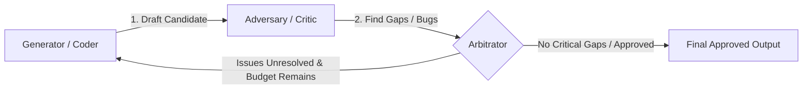

# Adversary / Red-Team Orchestration 🕵️‍♂️⚔️

The **Adversary (Red-Team)** pattern separates concerns by pitting a **Generator** (the builder) against a **Critic** (the adversary) in an iterative debate. The critic's single goal is to find bugs, logic flaws, security vulnerabilities, or policy violations in the generator's work.

---

## 1. Visual Architecture

---

## 2. Roles & Agent Personas

By separating the prompts and operational personas, you avoid the cognitive bias that occurs when a single model reviews its own generated content.

### A. The Generator (Builder)
*   **Prompt Instruction:** "Build the most functional, optimized, and complete solution to the user's request."
*   **Behavior:** Focuses on completeness, formatting, features, and speed.

### B. The Adversary (Critic / Red-Teamer)
*   **Prompt Instruction:** "Act as a hostile QA engineer, security auditor, or legal compliance manager. Review the builder's draft and identify any security holes, performance bottlenecks, unhandled edge cases, or policy drift."
*   **Behavior:** Reviews the code skeptically, looking for failure modes and gaps.

### C. The Arbitrator (Judge)
*   **Prompt Instruction:** "Review the builder's draft, the critic's comments, and the current run budget. Decide if the critic's points are resolved and whether to approve the output or send it back for another round."
*   **Behavior:** Acts as a neutral party to prevent infinite debates and enforce the budget.

---

## 3. The Debate Workflow

1.  **Drafting:** The Generator creates a candidate.
2.  **Red-Teaming:** The Adversary inspects the candidate, compiling a list of target gaps or issues.
3.  **Arbitration Check:** The Arbitrator reviews the critic's list:
    *   If no critical issues exist, the loop halts with approval.
    *   If issues exist and the round budget is not exhausted, the Arbitrator forwards the issues back to the Generator for revision.
    *   If the budget is exhausted, the Arbitrator halts the loop and escalates the best candidate + unresolved gaps to the human user.

---

## 4. When to Use
Use the **Adversary** pattern when:
*   **Security & Safety are critical:** (e.g., writing smart contracts, drafting database deletion scripts, handling payment processing logic).
*   The task has complex, rigid constraints (e.g., complying with data privacy regulations like GDPR, or enforcing hard architectural policies).
*   You want to eliminate confirmation bias in code generation.
