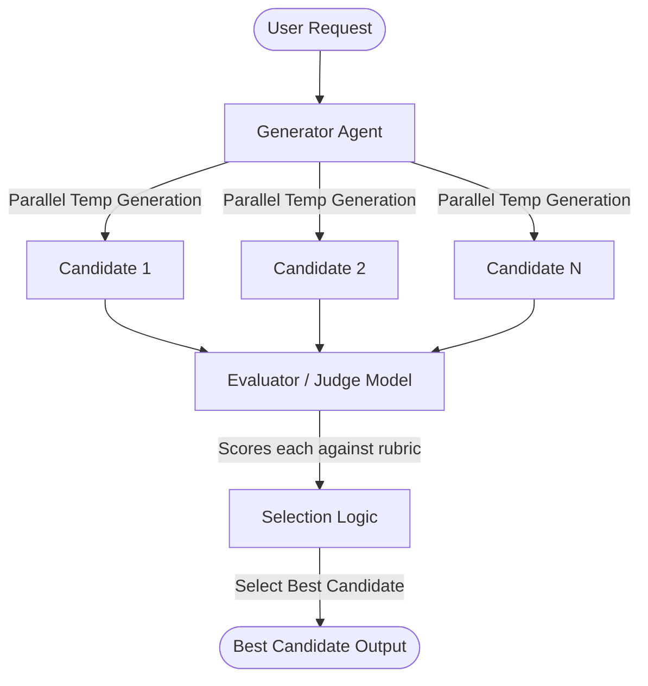

# Fan-Out / Best-of-N Orchestration 🦚🔀

The **Fan-Out (Best-of-N)** orchestration pattern generates multiple candidate solutions concurrently and uses an evaluation step to select the highest-quality output. It is optimized for speed and creative diversity.

---

## 1. Visual Architecture

---

## 2. Execution Mechanics

To achieve the best results with Fan-Out, you must coordinate two variables: candidate generation diversity and evaluation quality.

### A. Diverse Generation
*   **Temperature Tuning:** The generator must run with a higher model temperature (typically `0.7` to `1.0`). If the temperature is too low (close to `0`), the candidate outputs will be nearly identical, wasting API costs.
*   **Prompt Variations (Optional):** You can inject subtle variations or perspectives into each parallel generator prompt to force distinct approaches to the same task.

### B. Evaluation Strategies
Once candidates are generated, the orchestrator selects the winner using one of two methods:

1.  **Rubric-Based LLM Judge:**
    *   A specialized, neutral "Judge" LLM is prompted with a strict scoring checklist (e.g., rating coverage, structure, tone, and correctness on a 1-10 scale).
    *   The candidate with the highest aggregate score is returned.
2.  **Consensus / Majority Voting:**
    *   For mathematical, logical, or highly structured outputs (e.g., JSON schemas or compile-ready functions), the orchestrator groups identical outputs.
    *   The consensus choice (the output variant generated most frequently) is selected.

---

## 3. Operational Trade-offs

| Dimension | Trait | Operational Note |
| :--- | :--- | :--- |
| **Latency** | ⚡ **Very Low** | Since all $N$ completions run in parallel, the total wait time is just that of a single LLM request. |
| **Cost** | 💸 **High** | Token consumption scales linearly with $N$ (e.g., generating $5$ candidates costs $5\times$ more than a single call). |
| **Minimum $N$** | **3 to 5** | Fewer than 3 candidates does not yield enough variation to justify the pattern. |

---

## 4. When to Use
Use the **Fan-Out** pattern when:
*   **Sub-second response latency** is required (making sequential hill-climb loops too slow).
*   The task involves multiple valid creative answers (e.g., marketing copy, brainstorming architectures).
*   You have access to a cheap, high-throughput judge model to quickly evaluate the parallel outputs.
