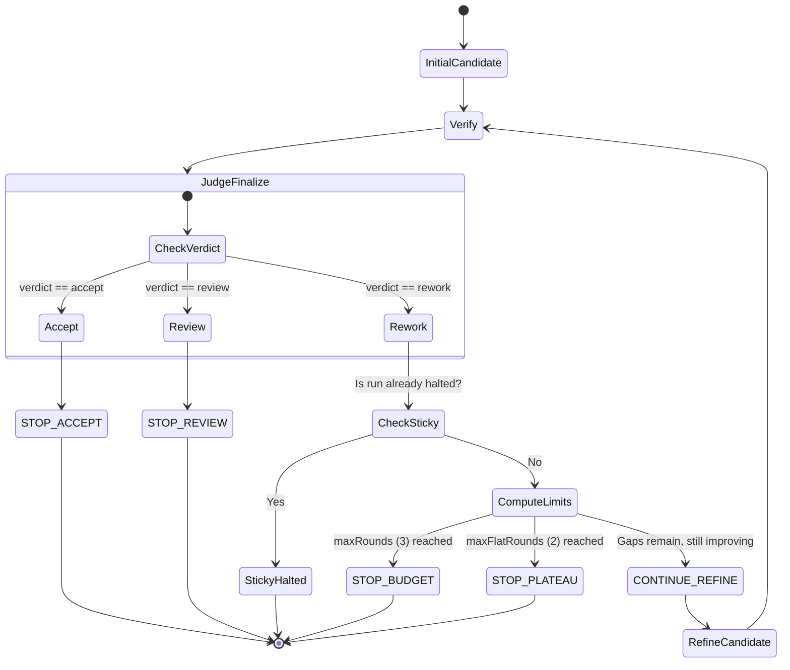

# Hill-Climb Refinement Loop 🧗‍♂️🔄

The **Hill-Climb Refinement Loop** (Self-Refine) is a sequential orchestration pattern designed to iteratively improve a candidate solution based on validation feedback. Rather than allowing an agent to retry unbounded, it enforces strict verification budgets, concrete progress checks, and sticky terminal outcomes.

---

## 1. Visual State Machine



---

## 2. Enforced Design Rules

To prevent runaway agent processes, the loop is guided by code-enforced constraints in [hillclimb.py](../../examples/hillclimb.py):

### A. Sticky Terminals
Once a run transitions to a terminal state (`STOP_BUDGET` or `STOP_PLATEAU`), it is frozen. Any subsequent calls using the same `runId` will immediately return the halted status. CO cannot bypass the limit by re-verifying.

### B. Concrete Improvement
To count as progress, a round must demonstrate measurable improvement:
*   The gap count shrinks (i.e., fewer issues are identified), **OR**
*   The confidence score rises by $\ge$ `minConfidenceDelta` (default `0.05`).
*   Confidence drift (small ups and downs $< 0.05$) or non-finite values (like `NaN` or `None`) are treated as flat (no improvement).

### C. Persistent Plateau Check
To account for evaluation noise, a flat round does not immediately trigger an abort. The run will continue unless it experiences `maxFlatRounds` (default `2`) *consecutive* non-improving rounds.

### D. Deferring Completed Work
All actions to record work (such as Scribe logs or Docs gate checkpoints) are deferred until a candidate returns a `STOP_ACCEPT` status. Intermediate candidates are never saved as completed tasks.

---

## 3. The State Contract (`state.json`)

The refinement state is saved across runs in a structured registry. Each active run contains a historical log of its verification rounds:

```json
{
  "run-uuid-1234": {
    "runId": "run-uuid-1234",
    "flatRounds": 0,
    "directive": "CONTINUE_REFINE",
    "lastUpdated": 1718968940.0,
    "rounds": [
      {
        "roundIndex": 0,
        "verdict": "rework",
        "gaps": ["missing unit tests", "method signature type-mismatch"],
        "confidence": 0.70,
        "timestamp": 1718968940.0
      }
    ]
  }
}
```

---

## 4. State Housekeeping (TTL and LRU)
To prevent infinite expansion of the state registry, states are pruned on every run update:
1.  **TTL (Time-to-Live):** Any run state older than 6 hours is deleted.
2.  **LRU Capping:** If the active registry exceeds 100 runs, the oldest run states (by `lastUpdated`) are pruned first.
