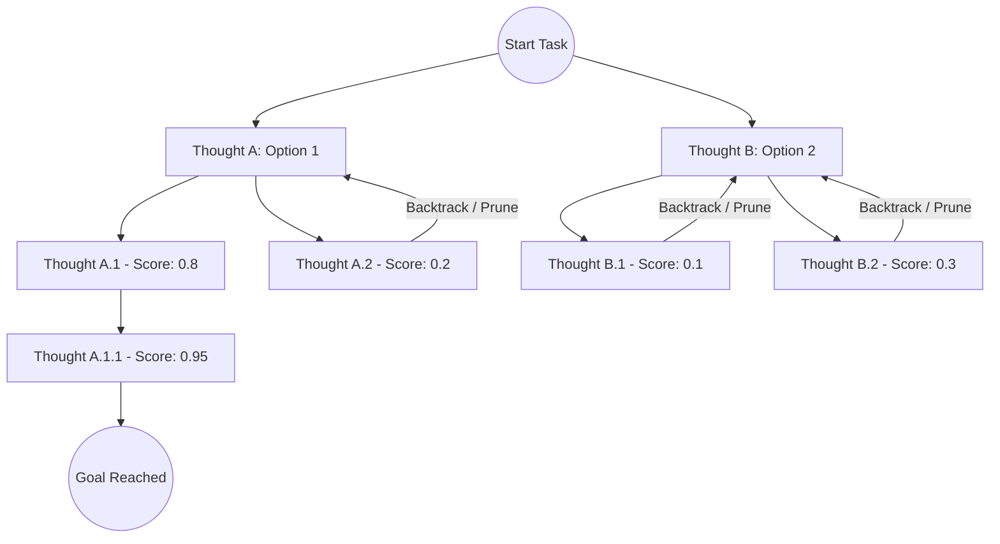

# Tree of Thoughts (ToT) Orchestration 🌲🔍

The **Tree of Thoughts (ToT)** pattern generalizes popular prompting techniques (like Chain of Thought) into a structured search over a state space of intermediate reasoning steps called "thoughts." It allows agents to self-evaluate different branches of reasoning, backtrack when a path fails, and systematically explore alternatives.

---

## 1. Visual Search Tree

---

## 2. Execution Mechanics

To implement a Tree of Thoughts pattern, your orchestrator coordinates four distinct steps:

### A. Thought Decomposition
The target task is broken down into small, intermediate reasoning steps. 
*   *Example (Math/Logic):* Instead of generating the entire proof, a thought is a single logical derivation.
*   *Example (Software Engineering):* Instead of writing the full patch, a thought is defining the interface, choosing the data structures, and then drafting individual functions.

### B. Thought Generator
At each node (current state of the task), the Generator LLM is asked to sample $N$ possible next steps. A slightly higher temperature is used to ensure the options are distinct.

### C. State Evaluator
A separate Evaluator LLM (or a deterministic test harness) assesses the current node state. The evaluation usually classifies the path into one of three states:
*   **Sure:** The path is highly likely to reach the goal.
*   **Likely:** The path shows promise but needs further derivation.
*   **Impossible:** The path has a logical error, compiler failure, or dead end, and should be pruned immediately.

### D. Search Algorithm (Orchestrator)
The harness navigates the tree of thoughts using standard search strategies:
1.  **Breadth-First Search (BFS):** Explores all promising thoughts at the current depth level before moving deeper.
2.  **Depth-First Search (DFS):** Explores a single reasoning path to its conclusion. If it hits an *Impossible* evaluation, it backtracks to the last *Likely* parent node.
3.  **Monte Carlo Tree Search (MCTS):** Runs random simulations of future steps from a node to evaluate its long-term potential.

---

## 3. Operational Trade-offs

| Dimension | Trait | Operational Note |
| :--- | :--- | :--- |
| **Latency** | ⏳ **Very High** | Requires sequential generation and evaluation of multiple steps along multiple paths. |
| **Cost** | 💸 **Very High** | Token usage scales with the breadth and depth of the search tree. |
| **Complexity** | ⚙️ **High** | The harness must maintain a state history, support rollbacks to previous checkpoints, and track evaluation scores. |

---

## 4. When to Use
Use the **Tree of Thoughts** pattern when:
*   The task requires long-horizon planning and logical consistency (e.g., proving math theorems, planning software architecture, writing complex books).
*   **Backtracking is essential:** There are many paths where a mistake made early makes the goal impossible to reach later.
*   API latency and costs are not strict constraints.
