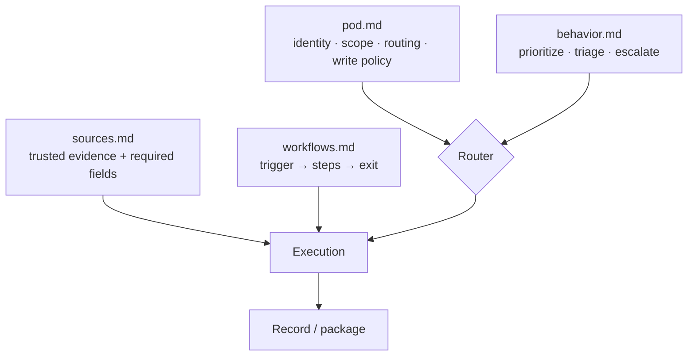
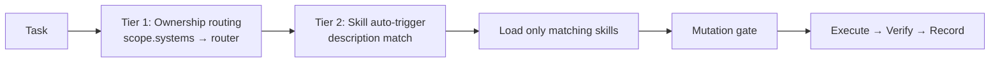

# Pods & Skill Routing 🧩🧭

Most agent harnesses hardcode their behavior in prompts and code. **Pods** invert that: a Pod is a small set of markdown files that encode *who owns a domain*, *how to prioritize and triage work in it*, *what evidence is trusted*, and *which playbooks to run* — with no code change required. A **skill-routing contract** then decides, for any given task, which skills load and what may be written. Together they make agent behavior portable, auditable, and selective.

This page documents the methodology vendored under [`pod-bundle/`](../pod-bundle/) (lifted from the field "pod-bundle-payload" toolkit) and how the [Cachy](the_agent_harness_stack.md) project instantiated it.

---

## 1. What is a Pod?

A **Pod** is a markdown-driven configuration unit for a system or product area. It is a folder of exactly **five required files** — if any is missing, the Pod is invalid and refuses to run:

```
pod-bundle/templates/pod-bundle/        # the canonical template
pods/<pod-name>/
  README.md     # human summary + packaging instructions
  pod.md        # metadata: id, owners, scope, routing, write policy
  behavior.md   # prioritization rules, triage table, escalation
  sources.md    # trusted evidence systems + required fields
  workflows.md  # named playbooks: trigger → steps → exit criteria
```



The discipline: **no free-form execution.** Work enters through a triage table, routes to an owning domain, runs a named workflow with explicit exit criteria, and is recorded.

---

## 2. The `pod.md` contract

`pod.md` carries YAML frontmatter — the Pod's identity and its **write policy** (the safety-critical part):

```yaml
---
id: cachy-core-platform
title: Cachy Core Platform
description: What this Pod tracks
owners:
  - alias: owner-name
    role: owner
scope:
  systems: [go-runtime, electron-app, wasm-plugins]
routing:
  defaultRouter: cachy-core
  allowedRouters: [cachy-core, cachy-desktop, cachy-extensions, cachy-ops]
writePolicy:
  defaultMode: read-only-first   # or read-only
  requiresMutationGate: true
---
```

- **`scope.systems`** anchors Tier-1 ownership routing (see §4).
- **`routing.allowedRouters`** bounds where work can be dispatched.
- **`writePolicy`** declares the default posture (`read-only-first`) and whether writes must pass the [mutation gate](#5-mutation-gate-tiers).

---

## 3. Behavior, sources & workflows

These three files turn the Pod from metadata into an operating procedure.

**`behavior.md` — a triage table** (condition → classification → action):

| Condition | Classification | Action |
| :--- | :--- | :--- |
| Go proxy change | `cachy-core` | route to core router |
| Electron/UI change | `cachy-desktop` | route to desktop router |
| WASM plugin change | `cachy-extensions` | route to extensions router |
| CI/release change | `cachy-ops` | route to ops router |

**`sources.md` — an evidence table** (what may be trusted, and the fields required before a decision):

| Source | Query / Scope | Required fields | Notes |
| :--- | :--- | :--- | :--- |
| GitHub | org/repo/project | id, title, status | primary truth |
| Local repo | files, git | path, commit | primary truth |
| Provider docs | reference | — | reference only |

**`workflows.md` — named playbooks.** Each is `Trigger → Steps → Exit Criteria`, never open-ended. Cachy's Pod ships four: *Runtime Feature*, *Desktop Feature*, *Extension Feature*, *Release Readiness*.

---

## 4. The skill-routing contract

[`pod-bundle/contracts/skill-routing.yaml`](../pod-bundle/contracts/skill-routing.yaml) is the machine-readable registry that maps **skills → routers → roles → gate tiers**, plus work-type playbooks. Activation is **two-tier** (see [`knowledge-base/41-skill-routing-architecture.md`](../pod-bundle/knowledge-base/41-skill-routing-architecture.md)):



- **Tier 1 — ownership routing:** the task's domain picks a router (e.g. `cordillera-router` for Kubernetes, `trapi-router` for APIM/.NET).
- **Tier 2 — skill auto-trigger:** only skills whose description matches the task load. A CSS fix loads `clean-code-typescript` and *never* a Kubernetes skill — the **selective-loading guarantee** that keeps context small.
- **Work-type playbooks** (`ad-hoc`, `feature`, `bug-fix`, `icm-incident`) follow one shape: **SENSE → ROUTE/GROUND → GATE → EXECUTE → VERIFY → RECORD.**

---

## 5. Mutation-gate tiers

Every write is classified and gated. Default posture is **read-only**; elevated actions require an explicit `ALLOW` (skill: [`pod-bundle/.claude/skills/mutation-gate/SKILL.md`](../pod-bundle/.claude/skills/mutation-gate/SKILL.md)):

| Tier | Scope | Requirement |
| :--- | :--- | :--- |
| `tier1_low` | read-only analysis | none |
| `tier2_elevated` | write to repo / CI / non-prod infra | gate `ALLOW` |
| `tier3_high_exposure` | production, credentials, security | gate `ALLOW` + escalation if uncertain |

Gate verdicts: **`ALLOW` · `REVISE` · `ESCALATE` · `BLOCK`** — default deny.

---

## 6. The skill library

The bundle stages two kinds of skills:

- **Shared / cross-cutting** — [`pod-bundle/.claude/skills/`](../pod-bundle/.claude/skills/) (17): `llm-agent-orchestration`, `building-ai-agents`, `evidence-grounded-investigation`, `mutation-gate`, `solutions-architecture`, `test-driven-development`, `code-review-and-quality`, `documentation-and-adrs`, `planning-and-task-breakdown`, `security-operations-mitre-attack`, and the `*-router` wrappers, among others.
- **Domain router-skills** — [`pod-bundle/router-skills/`](../pod-bundle/router-skills/): **Cordillera** (14 Kubernetes/Volcano skills) and **TRAPI** (5 Azure APIM/.NET skills), each staged for promotion via a `PR-README.md`.

---

## 7. Scaffold & package

Pods are created and shipped with the PowerShell scripts in [`pod-bundle/scripts/`](../pod-bundle/scripts/):

```powershell
# Scaffold a new Pod from the template (replaces __POD_NAME__ / __POD_ID__)
./pod-bundle/scripts/new-pod-bundle.ps1 -PodName my-pod

# Validate required files, zip each Pod, emit SHA256 + manifest.json
./pod-bundle/scripts/package-pod-bundles.ps1
```

Packaging validates that all five files exist, writes `dist/pods/<pod-name>.zip`, and records SHA256 integrity in `manifest.json` — making a Pod a **portable, auditable deliverable**.

---

## 8. Worked example: how Cachy used it

The thumb-drive bundle is the **pattern library**; [`Cachy/pods/cachy-core-platform/`](../../Cachy/pods/cachy-core-platform/) is a **concrete instantiation**. Cachy kept the five-file contract and the shared disciplines (mutation gate, evidence-grounded investigation, role separation) but defined its *own* routers (`cachy-core`, `cachy-desktop`, `cachy-extensions`, `cachy-ops`) and dropped the Cordillera/TRAPI domains it doesn't use. The porting analysis is recorded in [`Cachy/docs/pod-bundle-analysis.md`](../../Cachy/docs/pod-bundle-analysis.md).

> [!NOTE]
> **Reader's checklist:** Pod = 5 markdown files · `pod.md` declares scope + write policy · triage routes work to an owning domain · workflows have hard exit criteria · evidence is cited, not assumed · writes pass the mutation gate (default deny) · skills load selectively · Pods package to a SHA256-verified zip.

---

## Related

- [The Agent Harness Stack](the_agent_harness_stack.md) — where Pods sit in the wider workspace.
- [Agent Ownership Playbook](agent_ownership_playbook.md) — the human side of owning these behaviors.
- [Adversary / Red-Team](patterns/adversary.md) — the role-separation discipline Pods rely on.
