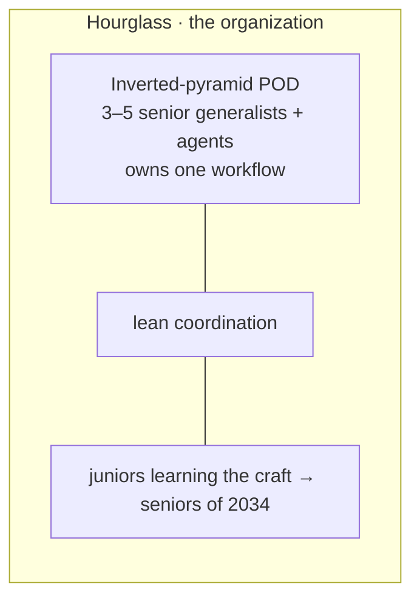

# Team Structures & Operating Models 🏛️⚙️

`cordillera` and `trapi` aren't fundamental to the harness — they're just two **teams** that happen to be wired in. In an agentic world, *how you structure a team* and *how the harness serves it* is itself a decision, and it's one you make **at initialization**. This page turns the org-design framework from an AWS talk by **Steven Brovich** (*"the companies that win aren't the ones with the best AI — they're the ones with the best operating model around the AI"*) into a configuration model: what the harness asks you on day one, and how each answer customizes pods, personas, the platform, and governance.

> [!NOTE]
> Source framework: Steven Brovich (AWS), *Economics · Talent · Structure · Governance*, drawing on the Anthropic "economic impact" study (Mar 2025), the HBR/AWS AI-readiness study, ThoughtWorks' *expert generalist* (Fowler, Jul 2025), and Singapore IMDA's *Model AI Governance Framework for Agentic AI* (Jan 2026). This page adapts it; it doesn't reproduce it.

---

## 1. The four questions = the init interview

The harness configures itself by answering four questions **in order** — each one narrows the next. Two more (*People, Pipeline*) close the loop.

| # | Question | What it configures in the harness |
| :--- | :--- | :--- |
| 1 | **Economics** | per-workflow model routing: `use` / `compose` / `build` (§2) |
| 2 | **Talent** | which expert-generalist **personas** staff the pod (§3) |
| 3 | **Structure** | team **shape** + operating **model A/B/C** (§4–5) |
| 4 | **Governance** | the agent identity / permission / monitoring / audit gates (§7) |
| 5 | *People* | which senior domain experts the pod centers on |
| 6 | *Pipeline* | learning mode — whether juniors stay in the loop (§6) |

> The whole configuration hangs off question 1, but the answer is **per workflow**, not per company.

---

## 2. Economics — `use` / `compose` / `build`

Training cost rises ~2.4×/yr while inference cost falls ~10×/yr — a "pricing scissors" opening 12–24×/yr. So *building* a model is a billion-dollar bet, while *using* one trends toward free. Three worlds result, and **a workflow can live in a different world than the company**:

| World | Meaning | Leverage / Differentiation | Harness mapping |
| :--- | :--- | :--- | :--- |
| **use** | consume a managed end-to-end AI | highest / lowest | route to a managed endpoint |
| **compose** | stitch frontier APIs into your context | medium / medium | **Cachy** proxies + composes frontier APIs (model-agnostic) |
| **build** | train / fine-tune your own | highest control / highest cost | self-hosted model behind the proxy |

This is exactly why the harness is **model-agnostic**: the economics answer per workflow becomes a routing rule, and Cachy (the proxy) is where `use`/`compose`/`build` are realized without changing the agent code.

```yaml
economics:
  defaultWorld: compose
  perWorkflow:
    incident-triage: use        # managed, speed over differentiation
    context-compression: build  # high-volume + differentiating → self-host
    code-review: compose
```

> The healthy path: day-one everything is `compose`; by month six you move volume to `use` and differentiators to `build`. The unhealthy path is declaring "we're a build shop" on day one.

---

## 3. Talent — staff pods with expert generalists

The valuable human is no longer the fastest *builder* but the fastest *orchestrator* — the "expert generalist" / "Renaissance developer" who points an agent at a problem, evaluates output, steers the next iteration, and knows when to overrule. Specialists broaden; generalists deepen (agents give them specialist-depth on demand); they meet in the middle.

**Harness mapping:** a pod is staffed by 2–3 [persona packs](packaging_and_personas.md) + agents filling the gaps — *not* one persona per lane. Hire/configure for durable traits, not the framework of the year:

```yaml
talent:
  personas: [site-reliability-engineer, devops-engineer, data-engineer]   # the pod
  hireFor: [curiosity, collaborativeness, customer-focus, first-principles]
```

---

## 4. Structure — the four team shapes

| Shape | Who's in it | Verdict |
| :--- | :--- | :--- |
| **Pyramid** | many juniors, few seniors directing | most orgs today; legacy |
| **Diamond** | thin base, fat middle of managers "overseeing AI" | ⚠️ the trap — cuts the pipeline |
| **Inverted pyramid** | 3–5 senior full-stack engineers, **agents do execution** | the **pod** — great execution, no learning path |
| **Hourglass** | execution at top, lean middle, **juniors learning on the way up** | the **learning org** that houses pods |

The two that matter operate at *different altitudes*: the **inverted pyramid is the pod** (a team owning a workflow end-to-end with AI execution), and the **hourglass is the organization** that keeps the junior pipeline alive around those pods.



**Harness mapping:** the pod *is* the existing [Pod](pods_and_skill_routing.md). `cordillera` and `trapi` are simply two pods/teams; the harness lets you configure **any** team's shape — they are no longer hardcoded routers.

```yaml
team:
  name: cordillera            # a configured team, not a built-in
  shape: inverted-pyramid     # the pod
  pods: 12
```

---

## 5. Operating models A / B / C — the core init switch

| Model | Shape | Scale | Harness consequence |
| :--- | :--- | :--- | :--- |
| **A — traditional ops** | engineering builds → throws over the wall to IT ops | — | **Dead.** Runbooks are deterministic; agents aren't; operators can't see/authorize the model. The harness treats A as a **migration plan, not a config.** |
| **B — embedded** | "you build it, you run it" — the same pod builds *and* operates | ≤ ~3 pods | full-stack pod ownership; Dora-Elite outcomes. No shared platform yet. |
| **C — B + platform** | pods on top of a shared platform (runtime · memory · identity · observability · discovery) | 10+ pods | the platform **enables**, never constrains: pods keep full autonomy + accountability; the platform is the road they build on. |

**This is the key realization for AIR:** Model C's "platform" *is the AIR stack itself* — [Agentic-Resource-Discovery](the_agent_harness_stack.md) (discovery), **Cachy** (runtime/proxy), **token-dashboard** (observability), **role-router** + **mutation-gate** (identity/governance). So choosing **B vs C at init decides which shared platform components the [AIR manifest](packaging_and_personas.md) installs**:

```yaml
team:
  operatingModel: C       # A = migrate · B = embedded · C = B + platform
  # C →  air installs the platform components (discovery, proxy, observability, governance)
  # B →  pods run self-contained; platform components omitted
```

Rule of thumb baked into the init: **B alone below ~3 pods; B+C at medium/large scale** (10+ pods, where duplicated auth/observability/guardrails start costing more than a platform would).

---

## 6. The four forces (and the guardrails they imply)

Four things are true at once; the leader's job — and the harness's config — is to *hold the tension*:

| Force | Reality | Harness guardrail |
| :--- | :--- | :--- |
| **Expert multiplier** | seniors + AI = order-of-magnitude speed | persona packs + skill routing |
| **Bottleneck shifts** | limit is now *data + decision speed*, not build | discovery (ARD) + decision support (token-dashboard) |
| **Verification tax** | AI gens 10× faster but is 3× harder to validate | role-router **QA/Judge** + [hill-climb](patterns/hill_climb.md) + [adversary](patterns/adversary.md) review |
| **Deskilling trap** | juniors ship 17% more, understand 17% less | **hourglass learning mode** — juniors stay in the review loop |

```yaml
pipeline:
  learningMode: hourglass    # keep juniors in the loop (counter deskilling)
  reviewLoop: required       # verification tax → mandatory QA/Judge pass
```

---

## 7. Governance as infrastructure — the four gates

Singapore's IMDA framework and Amazon's AgentCore independently converged on the **same four questions, asked before the agent acts** — enforced **outside the LLM loop, at the gateway** (you don't ask the agent nicely; you stop the request before the model sees it). *"Agents find their own path like a river; policy-as-code is the riverbank."*

| Governance question | Singapore/AgentCore dimension | Harness mechanism |
| :--- | :--- | :--- |
| **Who is the agent? Who authorized it?** | agent identity management | per-agent verifiable identity (role-router roles) |
| **What is it allowed to do?** | permission boundaries | [mutation-gate tiers](pods_and_skill_routing.md) (`tier1`–`tier3`, default deny) |
| **Is it performing as expected?** | lifecycle monitoring | role-router **output guard** + token-dashboard |
| **Can we audit what it did?** | end-to-end traceability | Scribe records + manifests / on-disk audit |

The architectural point: **separate who writes policy from who writes agents** — security owns the policies (the riverbank), engineering owns the agents (the river). That's already how the harness splits the mutation-gate/output-guard (policy) from the persona skills (agents).

```yaml
governance:
  agentIdentity: required          # no action without a named, authorized identity
  policyEnforcement: gateway       # outside the LLM loop
  tiers: { write: tier2, production: tier3 }
  audit: enabled
```

---

## 8. The init configuration, assembled

Everything above is one `harness.init.yaml` you set when standing up a team — the single artifact that customizes the harness for *your* operating model:

```yaml
team:
  name: cordillera                 # any team — cordillera/trapi are just examples
  shape: inverted-pyramid
  operatingModel: C                # A=migrate · B=embedded · C=B+platform
  pods: 12
economics:
  defaultWorld: compose            # use | compose | build  (per-workflow overrides)
talent:
  personas: [site-reliability-engineer, devops-engineer, data-engineer]
  hireFor: [curiosity, first-principles, customer-focus, collaborativeness]
governance:
  agentIdentity: required
  policyEnforcement: gateway
  tiers: { write: tier2, production: tier3 }
  audit: enabled
pipeline:
  learningMode: hourglass
  reviewLoop: required
```

The harness reads this and resolves: which [AIR components](packaging_and_personas.md) to install (B vs C), which [persona packs](packaging_and_personas.md) to load, the [mutation-gate](pods_and_skill_routing.md) posture, and the model-routing policy. **Cordillera and TRAPI become two saved init profiles**, not special cases.

---

## 9. Monday morning — six steps, in order

1. **Economics** — pick *one workflow* and answer: `use`, `compose`, or `build`?
2. **Talent** — staff the pod: 3–5 senior generalists max. Can't? You're not ready to `build` — `use` or `compose`.
3. **Structure** — are you Model A, B, or C? Answer honestly; if you're A calling it DevOps, that's a migration.
4. **Governance** — stand up the four gates as code at the gateway.
5. **People** — double down on the senior domain expert AI can't compress.
6. **Pipeline** — protect the juniors; don't trade the 2034 pipeline for 2026 senior hires.

---

## Related

- [Pods & Skill Routing](pods_and_skill_routing.md) — the pod the inverted pyramid refers to.
- [Packaging & Persona Packs](packaging_and_personas.md) — the components Model C installs and the personas that staff a pod.
- [The Agent Harness Stack](the_agent_harness_stack.md) — the stack that *is* the Model C platform.
- [Agent Ownership Playbook](agent_ownership_playbook.md) — the human accountability chain governance requires.
