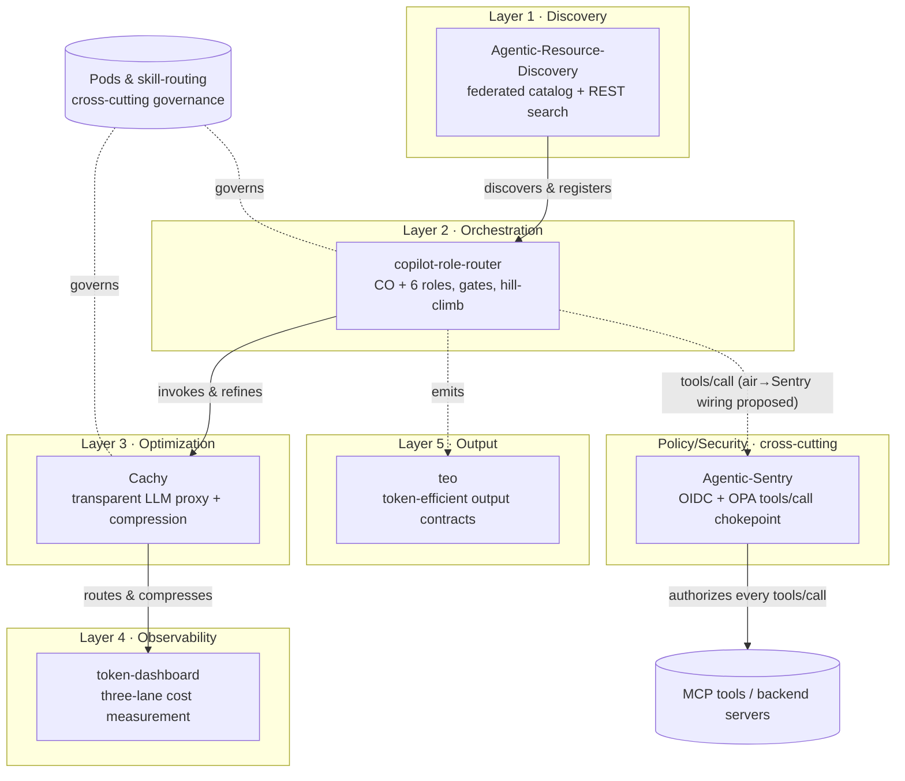

# The Agent Harness Stack 🏗️🤖

This primer doesn't live in isolation — it's the documentation layer over a working body of agent-harness projects in `~/air/workspace`. Each project owns one layer of the same problem: **discover** what agentic resources exist, **orchestrate** agents to do work, **optimize** what that work costs in-flight, **observe** where the cost actually goes, and **standardize** how agents emit results. A sixth, cross-cutting **Policy/Security** layer (Agentic-Sentry) authorizes what each agent is actually allowed to do. The [Pod & skill-routing](pods_and_skill_routing.md) methodology is the cross-cutting governance that ties them together.

This page maps the stack so a reader can see how the pieces fit before diving into any one.

---

## 1. The layers

Five layers own the work itself; a sixth, cross-cutting **Policy/Security** layer (Agentic-Sentry) sits between Orchestration and the MCP tools and authorizes every `tools/call`.

| Layer | Project | Owns the question |
| :--- | :--- | :--- |
| Discovery | Agentic-Resource-Discovery | "What agentic resources exist, and how do I find them?" |
| Orchestration | copilot-role-router | "How do specialized agents collaborate without spinning or shipping broken work?" |
| Optimization | Cachy | "How do I cut token cost *in-flight* without changing behavior?" |
| Observability | token-dashboard | "Where is the cost actually going, honestly?" |
| Output | teo | "How do agents emit results without inflating context?" |
| Policy/Security *(cross-cutting)* | Agentic-Sentry | "What is each agent actually allowed to do?" |

---

## 2. Layer 1 — Discovery: `Agentic-Resource-Discovery`

A specification + conformance tooling for a **federated discovery protocol** that lets LLMs find and invoke agentic resources (MCP servers, A2A agent cards, skills, APIs) by *search* rather than installing everything upfront.

- **Capability Manifest** at `/.well-known/ai-catalog.json` — entries with URN identifiers, media types, and representative queries for semantic search.
- **Domain-anchored URNs**: `urn:air:<publisher>:<namespace>:<agent-name>` (RFC 8141) for cross-registry dedupe.
- **REST interface**: `/agents`, `/search`, `/explore`.
- **9 ADRs** + a zero-dependency Python conformance CLI.
- Read: [`spec/ard.md`](../../Agentic-Resource-Discovery/spec/ard.md), [`spec/urn-naming-guide.md`](../../Agentic-Resource-Discovery/spec/urn-naming-guide.md), [`conformance/README.md`](../../Agentic-Resource-Discovery/conformance/README.md).

---

## 3. Layer 2 — Orchestration: `copilot-role-router`

A multi-role orchestrator deployed as native plugins across **five harnesses** (GitHub Copilot CLI, Claude Code, Gemini CLI, Google Antigravity, Cursor) from one shared `core/`. A single **Commanding Officer (CO)** is the entry point and delegates to specialized roles.

- **Six roles**: CO (orchestration), Recon (read-only discovery), Medic (diagnosis), Engineer (implementation), QA (verification), Judge (intent validation), Scribe (recording).
- **Two-tier Judge**: Tier-1 heuristic (keyword coverage + tripwires) merged anti-gaming with Tier-2 LLM that must cite evidence.
- **Hill-climb refinement** with code-enforced directives (`CONTINUE_REFINE` / `STOP_BUDGET` / `STOP_PLATEAU` / `STOP_ACCEPT`) persisted in `.role-router/state.json` — the same pattern documented in [`patterns/hill_climb.md`](patterns/hill_climb.md).
- **Output guard** scans every tool result for injection / credential leakage / encoded payloads before it reaches the model.
- Read: [`AGENTS.md`](../../copilot-role-router/AGENTS.md) (cross-harness CO protocol), [`core/roles.mjs`](../../copilot-role-router/core/roles.mjs), [`core/repeatable-actions.mjs`](../../copilot-role-router/core/repeatable-actions.mjs).

> [!NOTE]
> The role separation here (recon / engineer / QA / judge / scribe) is the same discipline Pods assume — see [Pods & Skill Routing](pods_and_skill_routing.md) §5.

---

## 4. Layer 3 — Optimization: `Cachy`

A clean-room **Go-first LLM context-optimization proxy** that transparently sits between agents and providers (OpenAI- and Anthropic-compatible), compressing context and serving local content without changing provider semantics.

- **Transparent proxy**: streams SSE without buffering, preserves semantics, propagates cancellation.
- **Cache-safe compression**: live-zone detection protects stable system/assistant content; native compressors for text, logs, JSON, diffs, code.
- **CCR (content-addressed retrieval)**: reversible markers `[[cachy-ccr:v1 sha256:<hash> bytes:<n>]]`, local object store, no secrets in markers.
- **WASM plugin host**: default-deny `wazero` sandbox with time/memory/IO limits.
- **Pod-governed**: ships the [`cachy-core-platform`](../../Cachy/pods/cachy-core-platform/) Pod — the worked example in the Pods page.
- Read: [`README.md`](../../Cachy/README.md), [`docs/ccr-architecture.md`](../../Cachy/docs/ccr-architecture.md), [`docs/agent-integrations.md`](../../Cachy/docs/agent-integrations.md).

---

## 5. Layer 4 — Observability: `token-dashboard`

A local-first dashboard that shows **where AI token usage goes** across Codex, Claude Code, ChatGPT, Claude chat, Copilot, Gemini, and Cursor — and refuses to lie about precision via a **three-lane model**:

| Lane | Meaning | Rule |
| :--- | :--- | :--- |
| **EXACT** | measured tokens from logs | summed into `exact_total` |
| **ACTIVITY** | measured counts (messages, convos) | counted, never tokenized |
| **ESTIMATE** | labeled bands for unmeasured sources | shown as a range, never merged |

Hard rules: never sum exact + estimate; never render an estimate as a single number; fidelity label (`measured`/`floor`/`rough`) always visible. The guiding question it answers is *"what work should I hand the computer next?"*

- Read: [`README.md`](../../token-dashboard/README.md), [`skill/SKILL.md`](../../token-dashboard/skill/SKILL.md), [`skill/references/data-contract.md`](../../token-dashboard/skill/references/data-contract.md).

---

## 6. Layer 5 — Output: `teo`

**Token-Efficient Outputs** — an early-stage specification standardizing how agents express results so downstream agents can parse and forward them without inflating the context window. Complements ARD (discovery), role-router (orchestration), and Cachy (compression) by fixing the *output contract*.

- Read: [`teo/README.md`](../../teo/README.md) (specification in progress).

---

## 7. Policy/Security (cross-cutting) — `Agentic-Sentry`

A secure **MCP gateway** that is the single **OIDC + OPA chokepoint** for tool traffic: every `tools/call` is authorized before it reaches a backend tool. It cuts across the other five layers rather than sitting above or below any one of them.

- **OIDC at the door**: v1 uses Streamable HTTP with OIDC JWT (Azure Entra, Google, Cognito, Okta, generic OIDC) or a static bearer token; with OIDC configured it fails closed and the static token cannot bypass auth + RBAC.
- **OPA decision per call**: the gateway authorizes each `tools/call` by querying OPA at `data.mcp.auth.decision` with `{server_name, tool_name, arguments, subject_id, subject_email, provider, groups}` and forwards only on `allow`. Policies are Rego with three-tier group RBAC supplied via a data overlay (`data.mcp.auth.config.group_rbac`), not hardcoded IDs.
- **Backend proxy is v2**: the "forward only on allow" backend MCP proxy is not yet wired — `handleToolsCall` authorizes and returns a v1 stub rather than proxying to a real backend server.
- **air integration is proposed**: routing the harness's orchestrated tool traffic through Sentry (MCP-config injection in `air bootstrap` → the gateway URL) is **not yet built** — Sentry is not in `harness.manifest.yaml` and `air` writes no Sentry MCP config. See [`integration-plan.md`](integration-plan.md) (Seam ①, Phases 1–2) for the proposed wiring.
- Read: [`README.md`](../../Agentic-Sentry/README.md), [`docs/architecture.md`](../../Agentic-Sentry/docs/architecture.md), [`docs/authentication-oidc.md`](../../Agentic-Sentry/docs/authentication-oidc.md), [`docs/agent_security_opa.md`](../../Agentic-Sentry/docs/agent_security_opa.md).

---

## 8. Cross-cutting themes

The same five ideas recur at every layer — which is why they belong in a primer, not just a project README:

1. **Routing & classification** — ARD routes by query, role-router routes by task type, Cachy routes by traffic, teo routes by output shape.
2. **Skills as a primitive** — discovered (ARD), orchestrated (role-router), proxied (Cachy/MCP), measured (token-dashboard), standardized (teo).
3. **Pods & modular behavior** — role-router's roles, Cachy's markdown Pod, token-dashboard's `SKILL.md` are all the [Pod pattern](pods_and_skill_routing.md).
4. **Evidence-based gates** — Judge requires citations; Cachy treats originals as sensitive; the dashboard labels fidelity.
5. **Privacy-first & cross-harness** — guards redact credentials, telemetry stores metadata only, one core ships to many harnesses.

---

## Related

- [Pods & Skill Routing](pods_and_skill_routing.md) — the governance layer across the stack.
- [Agentic Workflows Primer](agentic_workflows_primer.md) — foundational concepts.
- [Orchestration Patterns](patterns/orchestration_patterns.md) — the patterns role-router implements.
- [Self-Hosted Docker MCP Gateway](docker_mcp_gateway.md) — the tool-serving layer these agents consume.
