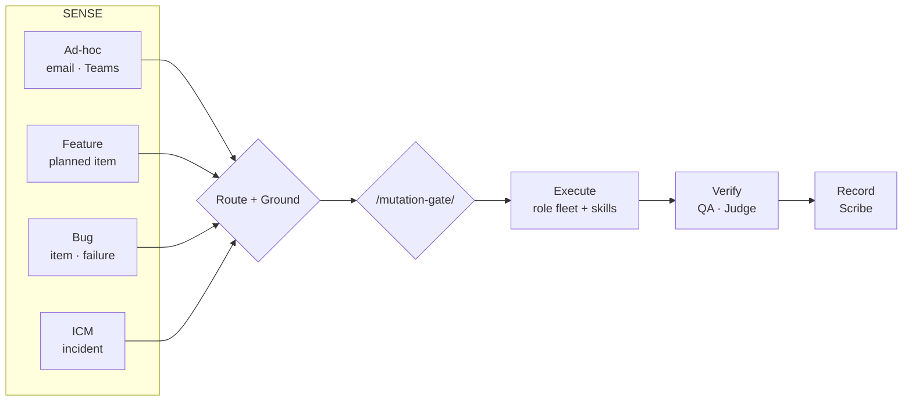

# 41 — Skill Routing & Selective-Loading Architecture

> How the ~30 imported domain-expert skills attach to the three-system workflow
> (chief-of-staff = cockpit, agent-coordination = brain/guardrails, Omnigent supervisor
> = engine; archived: copilot-role-router) **without** loading the whole library on every task.
>
> Contract: `contracts/skill-routing.yaml`. Personal toggle: `~/.claude/skills/skill-toggle.ps1`.

## Why

A k8s skill should never load for a UI task. Skills surface by the task's **domain**
and the task's **intent** — not all at once. Three mechanisms compose to make that true.

## Two-tier activation (+ gate binding)

```mermaid
flowchart TD
    T[Task / signal / work item] --> R{Tier-1: ownership routing<br/>/platform-router · co-dispatch.ps1}
    R -->|TRAPI| TR[trapi-router skill set<br/>APIM · Azure · ASP.NET]
    R -->|Cordillera| CR[cordillera-router skill set<br/>K8s · Grafana · GitHub]
    R -->|shared / either| SH[shared skill set<br/>.claude/skills]
    TR --> D{Tier-2: skill auto-trigger<br/>each skill's description frontmatter}
    CR --> D
    SH --> D
    D -->|matches intent| L[Load SKILL.md body<br/>references/ on deeper demand]
    D -->|no match| X[Skill stays dormant]
    L --> G{Action mutates?}
    G -->|read-only knowledge| OK[Proceed]
    G -->|write/mutate| GATE[/mutation-gate/<br/>ALLOW · REVISE · ESCALATE]
```

1. **Tier-1 — ownership scoping (brain).** `/platform-router` / `scripts/co-dispatch.ps1`
   classifies the task to an owning domain and selects *which router's skill set* is in
   scope. A UI/TypeScript task gets `clean-code-typescript` (shared), never Cordillera k8s.
2. **Tier-2 — skill auto-trigger (progressive disclosure).** Within the in-scope set, each
   skill's `description` frontmatter triggers it only on a matching task; the `SKILL.md`
   body loads on trigger, `references/` only on deeper demand. A Cordillera *networking*
   task loads `kubernetes-networking`, not `-storage`.
3. **Gate binding.** Loading a skill is read-only knowledge. *Acting* on a skill's mutating
   procedure (cluster upgrade, RBAC change, GitOps promote, APIM policy publish) still
   passes `/mutation-gate`. `contracts/skill-routing.yaml` tags each skill with the gate
   tier its actions imply.

## Where the governed copies live

| Set | Location | Promotion |
| --- | --- | --- |
| Cordillera (11 k8s) | `router-skills/cordillera/` | PR into `../cordillera-agent-system/.claude/skills` |
| TRAPI (5: APIM/CSPM/.NET) | `router-skills/trapi/` | PR into `../trapi-agent-system/.claude/skills` |
| Shared (6 cross-cutting) | `.claude/skills/` | already governed here |
| Personal (all 30, toggleable) | `~/.claude/skills/` | ungoverned; not gate-bound |

TRAPI/Cordillera repos are **production** — their skills stage here and promote via a
reviewed PR, never a direct write.

## The 4 work-type playbooks (chief-of-staff "Workflows" tab)

Each work-type flows through the same loop —
**SENSE → ROUTE/GROUND → GATE → EXECUTE → VERIFY → RECORD** — but enters from a different
source, orders differently, loads different skills, and hits a different gate tier.



### 1. Ad-hoc (email / Teams) — severity-ordered
WorkIQ signal → CO triage → **recon** gathers context read-only (repos + WorkIQ) →
if a reply/work-item is created, **Tier-2** gate → execute on approval → Scribe records,
signal closed. Skills: `technical-program-management` (prioritization). Interrupt-driven.

### 2. Feature work — priority-ordered
Planned work item → `idea-refine` + `planning-and-task-breakdown` → `/platform-router`
selects the domain skill set → **engineer** builds with the domain skill
(`kubernetes-*` / `api-management` / `dotnet-*`) + `solutions-architecture` → **QA**
(`test-driven-development`) → **Judge** → **Scribe**. Gate: **Tier-2** at merge/deploy.

### 3. Bug fixes — severity-ordered
Bug item or failure → **recon** repro (read-only) → **medic** fixes with the domain skill →
**QA** regression → **Judge** → **Scribe**. Gate: **Tier-2** for the fix; **Tier-3** if it
is a production hotfix (Grande / TRAPI prod).

### 4. Incident response from ICM — severity-ordered (NEW entry source)
ICM incident → **recon** triage read-only with `security-operations-mitre-attack` +
`kubernetes-observability` → mitigation proposed → **Tier-3 ESCALATE** gate (production,
always explicit authorization) → execute on approval (**medic/engineer**) → **QA** verify →
**Scribe** writes the ICM update + post-incident note.

## Selective-loading guarantee (worked examples)

| Task | Tier-1 scope | Skill(s) loaded | NOT loaded |
| --- | --- | --- | --- |
| Fix dashboard CSS | shared | `clean-code-typescript` | any `kubernetes-*`, `dotnet-*` |
| Bonete pod won't schedule | cordillera | `kubernetes-autoscaling-scheduling` | `kubernetes-storage`, TRAPI skills |
| APIM rate-limit policy review | trapi | `api-management` | all k8s, .NET fundamentals |
| TRAPI snapshot API 500s | trapi | `dotnet-web-development` | all k8s, APIM |
| ICM: Grande latency spike | cordillera | `kubernetes-observability`, `security-operations-mitre-attack` | `-storage`, `-gitops-cicd` |

## Maintenance

- New imported skill → add a row to `contracts/skill-routing.yaml` under its router, copy
  the folder into the matching `router-skills/<domain>/` or `.claude/skills/`, and (for the
  personal toolbox) `~/.claude/skills/`. Content skills are **never** added to
  `capabilities.json` (that manifest is for thin router wrappers, not skill bodies).
- Promote a router-staged set to production via PR from `router-skills/<domain>/`.
- The Workflows tab in `.github/extensions/chief-of-staff/extension.mjs` renders these 4
  playbooks; keep it in sync with the `work_types` block of `skill-routing.yaml`.
