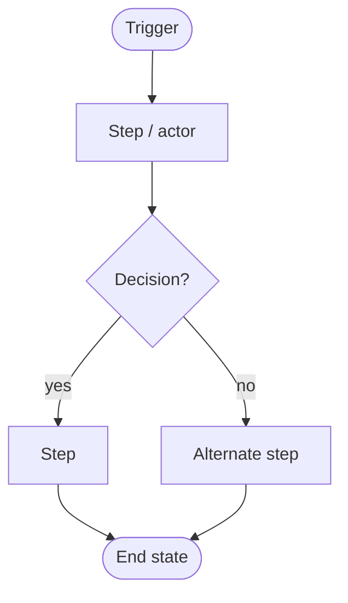

# Process Map: <process name>

- **Author / BA:** <name> · **Date:** YYYY-MM-DD · **Status:** as-is | to-be

## Purpose & scope
What process this maps, its start trigger and end state, and why we're mapping it.

## Actors / roles
- <role> — responsibility in this process.

## Flow

## Steps
| # | Step | Actor | System | Inputs | Outputs |
| :--- | :--- | :--- | :--- | :--- | :--- |
| 1 | <step> | <role> | <system> | <input> | <output> |

## Pain points / opportunities  *(as-is)*
- <bottleneck, handoff, rework, manual step ripe for automation>

## Proposed changes  *(to-be)*
- <change> → <expected improvement / metric>

## Handoffs & SLAs
- <from → to>: <expectation / time>
