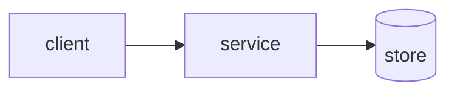

# PDR: <system / component name> — Design Review

> Preliminary / Project Design Review — reviewed *before* build to validate the
> approach. Pairs with [ADR](adr.template.md) (records a single decision) and
> [tech-design-doc](tech-design-doc.template.md) (the detailed design).

- **Status:** Draft | In review | Approved | Rejected | Conditionally approved
- **Author:** <name> · **Reviewers:** <arch, security, SRE, …>
- **Date:** YYYY-MM-DD · **Related:** <PRD, ADRs, epics>

## 1. Objective & scope
What is being designed and the boundaries of this review.

## 2. Requirements & constraints
Functional, non-functional (latency, throughput, availability), and hard
constraints (compliance, budget, deadlines). Cite the source of each.

## 3. Proposed architecture
Diagram + narrative. Components, data flow, interfaces, trust boundaries.

## 4. Alternatives & trade-offs
| Option | Pros | Cons | Verdict |
| :--- | :--- | :--- | :--- |
| <chosen> | … | … | ✅ |
| <alt> | … | … | ❌ |

## 5. Cross-cutting review
- **Security & privacy:** threat model, data classification, authz.
- **Reliability:** failure modes, SLOs, blast radius, rollback.
- **Operability:** observability, runbooks, on-call impact.
- **Cost:** infra + run cost estimate.

## 6. Risks & open questions
| Risk / question | Impact | Mitigation / owner |
| :--- | :--- | :--- |

## 7. Review outcome
- **Decision:** … · **Conditions / action items:** … · **Sign-off:** <names>
