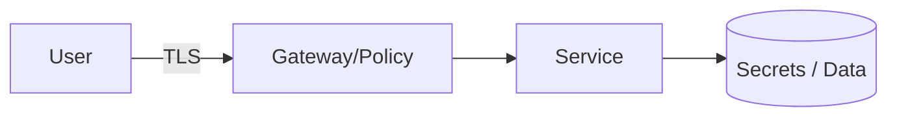

# Threat Model: <system / feature>

> STRIDE-based. Do it at design time (pairs with the [PDR](../decisions/pdr.template.md))
> and revisit when the architecture or trust boundaries change.

- **Author:** <name> · **Reviewers:** <security, owning team> · **Date:** YYYY-MM-DD
- **Status:** Draft | Reviewed · **Data classification:** public | internal | confidential | PII/PHI

## 1. Scope & assets
What's in scope, and the assets worth protecting (data, secrets, availability, integrity).

## 2. Architecture & trust boundaries
Diagram with trust boundaries (where data crosses a privilege/network line).

## 3. Entry points & actors
- **External actors:** <user, partner, attacker> · **Entry points:** <APIs, queues, uploads>

## 4. Threats (STRIDE)
| ID | Element | Category | Threat | Likelihood | Impact | Mitigation | Status |
| :--- | :--- | :--- | :--- | :--- | :--- | :--- | :--- |
| T1 | <component> | Spoofing | <threat> | M | H | <control> | Open |
| T2 | <component> | Tampering | … | | | | |

> STRIDE = Spoofing · Tampering · Repudiation · Information disclosure · Denial of service · Elevation of privilege.

## 5. Controls & assumptions
- **Existing controls relied on:** authn/z, encryption, rate limits, WAF, secrets mgmt.
- **Security assumptions** (validate): <…>

## 6. Residual risk & decisions
Accepted risks (with owner + rationale) and follow-up action items → tickets.
